# Intégrer examina.io à Moodle {#integrate-examinaio-with-moodle}

Connectez examina.io à Moodle une fois, puis laissez les enseignants ajouter des évaluations publiées.
à leurs cours sans envoyer les apprenants vers une page de connexion distincte. Apprenants
ouvrez l'évaluation dans Moodle et examina.io peut renvoyer ses scores à
le carnet de notes Moodle.

!!! tip "Valider avant une évaluation en direct"
    Connectez et validez le flux de travail complet dans un Moodle hors production
    cours avec des utilisateurs fictifs avant de l'activer pour une évaluation en direct.

Les captures d'écran de ce guide utilisent un cours fictif du **Northbridge College**,
**Introduction à la biologie** et une évaluation intitulée **Structure cellulaire et
Fonction**. Votre organisation, vos URL, vos identifiants et les noms de cours seront différents.

## Ce que l'intégration apporte {#what-the-integration-provides}

- **Une seule connexion Moodle :** un apprenant qui ouvre l'activité dans Moodle ne le fait pas.
  reconnectez-vous à examina.io.
- **Sélection d'évaluation :** un enseignant choisit un examen publié via LTI
  Deep Linking au lieu de copier l’URL d’un examen.
- **Placement orienté cours :** examina.io associe le cours et l'activité LMS
  avec l’évaluation publiée sélectionnée.
- **Retour de note :** Les services d'affectation et de note LTI (AGS) peuvent renvoyer le
  le résultat de l'apprenant à l'élément de note correct Moodle.
- **Liste de cours facultative :** Les services de provisioning de noms et de rôles (NRPS) peuvent
  fournissez une liste minimale de cours lorsque votre établissement le permet.

## Avant de commencer {#before-you-start}

Il vous faut :

- un compte Root ou Administrateur dans examina.io ;
- un compte administrateur de site Moodle ;
- un compte enseignant pour le cours Moodle ;
- au moins un examen importé et publié dans examina.io Manager ;
- adresses HTTPS publiques pour Moodle et examina.io ; et
- autorisation de configurer un outil externe LTI 1.3 et ses services dans Moodle.

Assurez-vous que les deux systèmes disposent d’horloges précises. Les messages de connexion LTI sont limités dans le temps,
et une différence d'horloge importante peut entraîner l'échec d'un lancement autrement valide.

## Comment les deux systèmes échangent leurs paramètres {#how-the-two-systems-exchange-settings}

Moodle crée l'**ID client** et l'**ID de déploiement** dont examina.io a besoin.
examina.io crée ensuite l'URL de clé publique spécifique à l'enregistrement que Moodle
besoins. Pour cette raison, la configuration initiale comporte deux étapes :

1. créer un outil externe provisoire dans Moodle ;
2. copiez les détails d'enregistrement de Moodle dans examina.io ;
3. recopiez les points de terminaison finaux examina.io dans Moodle ; et
4. activez l'enregistrement et testez le flux complet.

!!! warning "Ne pas lancer un outil provisoire"
    Si Moodle nécessite une URL de clé publique lors du premier passage, utilisez une URL temporaire.
    Point de terminaison du jeu de clés HTTPS contrôlé par votre institution. Il peut renvoyer un
    Jeu de clés Web JSON vide (`{"keys":[]}`). Ne mettez pas l’outil à la disposition de
    cours ou tenter un lancement jusqu'à ce que vous l'ayez remplacé par le modèle exact
    examina.io **Jeu de clés publiques (JWKS)** URL à l'[Étape 4](#4-finish-the-moodle-tool).

## 1. Créez l'outil provisoire Moodle {#1-create-the-provisional-moodle-tool}

Connectez-vous avec un compte d'administrateur de site Moodle et ouvrez ** Site
administration** depuis la navigation principale.

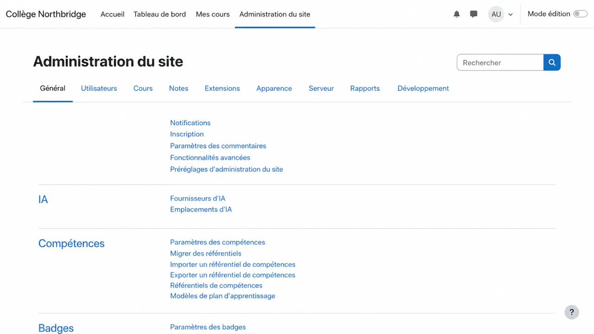

Sélectionnez l'onglet **Plugins**. Sous **Modules d'activité**, sélectionnez **Externe
outil**.

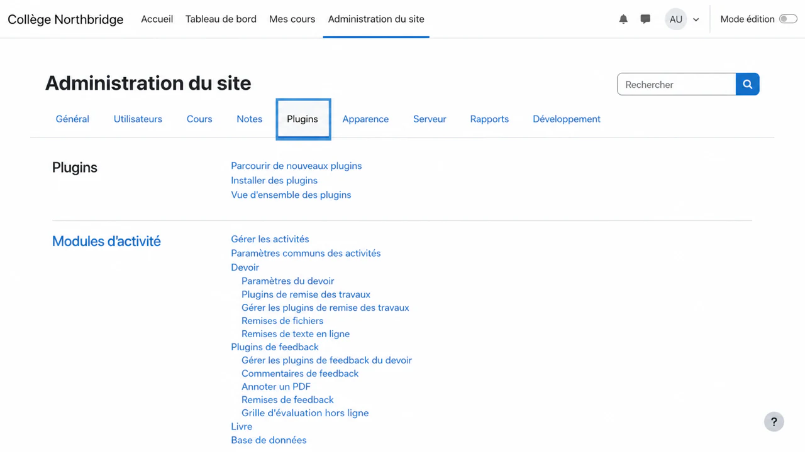

Sur la page Paramètres des outils externes, sélectionnez **Gérer les outils**.

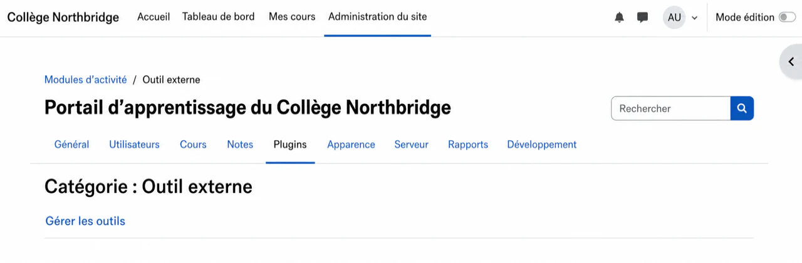

Sélectionnez **Configurer un outil manuellement**. Si un autre outil examina.io est déjà
existe, modifiez-le au lieu de créer un double.

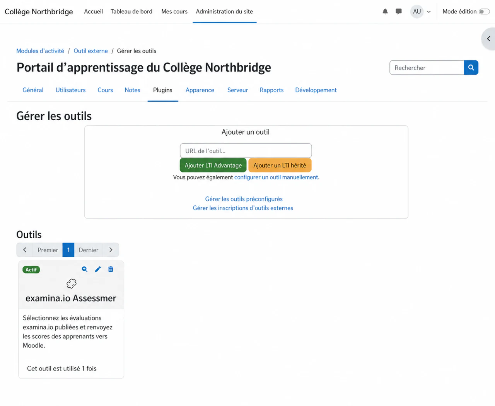

Remplissez le formulaire outil :

1. Saisissez **examina.io Assessments** comme nom de l'outil.
2. Saisissez `https://www.examina.io/lti/launch` comme **URL de l'outil**.
3. Définissez **Version LTI** sur **LTI 1.3**.
4. Définissez **Type de clé publique** sur **URL du jeu de clés**.
5. Saisissez l'URL du jeu de clés provisoire décrite ci-dessus.
6. Saisissez `https://www.examina.io/lti/login` comme **URL de lancement de la connexion**.
7. Ajoutez les URL de lancement et de lien profond en tant qu'**URI(s) de redirection** distincts :
   `https://www.examina.io/lti/launch` et
   `https://www.examina.io/lti/deep-link`.
8. Activez **Prend en charge les liens profonds** et entrez
   `https://www.examina.io/lti/deep-link` comme **URL de sélection de contenu**.
9. Gardez l'outil caché du sélecteur d'activité jusqu'à ce que la configuration soit terminée.
   terminer, puis enregistrez-le.

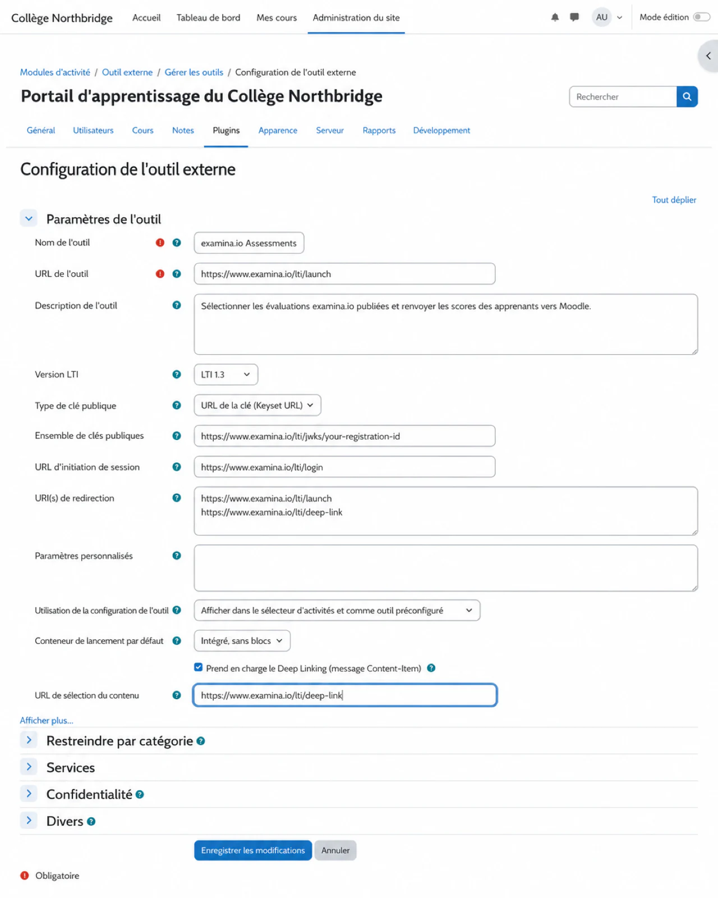

!!! warning "La valeur JWKS dans la capture d'écran est un exemple"
    `your-registration-id` est un espace réservé et non une valeur à copier. Après toi
    enregistrez les détails de Moodle dans examina.io, remplacez cette URL entière par le
    URL exacte **Jeu de clés publiques (JWKS)** indiquée sur la carte d'enregistrement enregistrée.

Moodle attribue désormais l'identité d'outil requise par examina.io.

## 2. Copiez les détails d'enregistrement de Moodle {#2-copy-moodles-registration-details}

Revenez à **Gérer les outils**, recherchez les **évaluations examina.io** et sélectionnez **Afficher
détails de configuration**. Gardez cette page ouverte pendant que vous configurez examina.io.

Copiez ces valeurs Moodle dans les champs examina.io correspondants :

| Détail de la configuration Moodle | Champ d'enregistrement examina.io |
| --- | --- |
| ID de plateforme | URL de l'émetteur |
| Identifiant client | Identifiant client |
| ID de déploiement | ID de déploiement |
| URL de demande d'authentification | Point de terminaison d'autorisation |
| URL du service de jeton d'accès | Point de terminaison du jeton |
| URL du jeu de clés publiques | Clés publiques LMS (JWKS) URL |

Traitez les identifiants comme des données de configuration. Ne pas mettre de jetons d'accès, privés
clés, messages de lancement de l'utilisateur ou mots de passe dans la documentation ou les tickets d'assistance.

## 3. Ajoutez l'enregistrement Moodle dans examina.io {#3-add-the-moodle-registration-in-examinaio}

En tant que racine ou administrateur examina.io :

1. Ouvrez **Accueil → Paramètres**.
2. Recherchez **Apportez Examina dans votre LMS**.
3. Sélectionnez **Ajouter une inscription**.
4. Choisissez **Moodle** et entrez un nom descriptif, tel que **Northbridge
   Collège Moodle**.
5. Collez les six valeurs Moodle de l'étape 2.
6. Activez uniquement les services que vous accorderez également dans Moodle :
   - **Sélection d'évaluation (Deep Linking)** permet aux enseignants de choisir une évaluation publiée
     examen à partir du formulaire d’activité Moodle.
   - **Retour de notes (AGS)** envoie les résultats complétés au carnet de notes Moodle.
   - **Liste des cours (NRPS)** lit l'adhésion au cours lorsque votre flux de travail en a besoin
     ça.
7. Sélectionnez **Enregistrer l'enregistrement**.

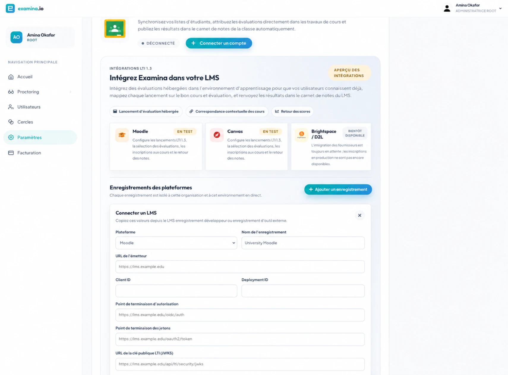

La carte d'enregistrement enregistrée affiche l'**initiation de connexion exacte **OIDC**, **LTI
lancement**, **Deep Linking** et **Jeu de clés publiques spécifiques à l'enregistrement (JWKS)**
points finaux. Gardez la carte ouverte pour la prochaine étape.

## 4. Terminez l'outil Moodle {#4-finish-the-moodle-tool}

Modifiez les **évaluations examina.io** dans Moodle et remplacez chaque valeur provisoire
avec la valeur exacte indiquée par examina.io :

| Champ d'outils externes Moodle | Valeur de examina.io |
| --- | --- |
| URL de l'outil | URL de lancement LTI |
| Initier l'URL de connexion | OIDC initiation à la connexion |
| URI(s) de redirection | URL de lancement LTI et URL de lien profond, une par ligne |
| Jeu de clés publiques | Jeu de clés publiques (JWKS) |
| URL de sélection de contenu, lorsqu'elle est affichée | URL de liens profonds |

Configurez ensuite les services Moodle et les paramètres de confidentialité :

- Activez **Services d'affectation et de notation IMS LTI** si vous avez activé **Grade
  retour (AGS)** dans examina.io.
- Autoriser l'outil à accepter les notes des paramètres de service délégué de Moodle.
- Activez **Names and Role Provisioning Services** uniquement si vous avez activé **Cours
  liste (NRPS)** et votre établissement autorise l'accès à la liste.
- Rendre l'outil disponible dans le sélecteur d'activité après le point final et
  les paramètres du service sont terminés.
- Utilisez **Embed** comme conteneur de lancement par défaut si vous souhaitez que l'évaluation
  restez sur la page du cours Moodle.

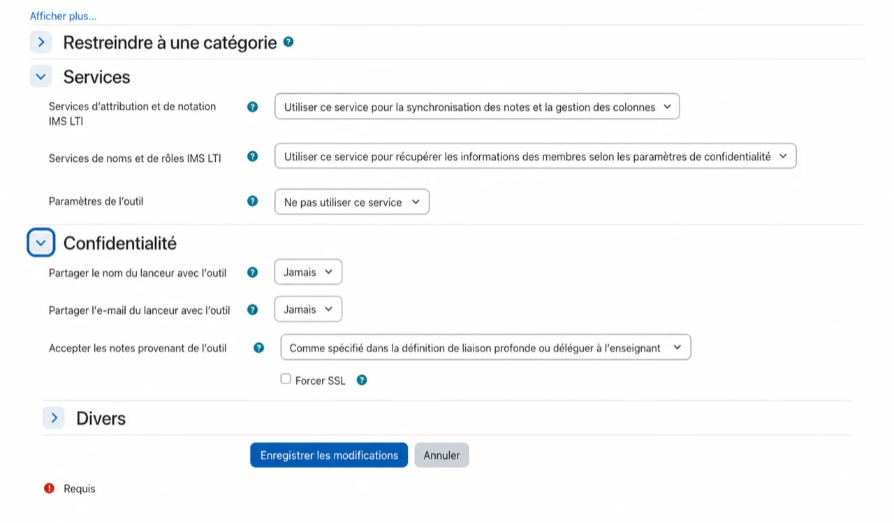

Le partage d’un nom d’affichage ou d’une adresse e-mail Moodle est facultatif. examina.io peut cartographier
un apprenant LTI utilisant l'identifiant de sujet pseudonyme de la plateforme. Activer
champs de profil supplémentaires uniquement lorsque votre institution a un besoin documenté et
base légale pour les partager.

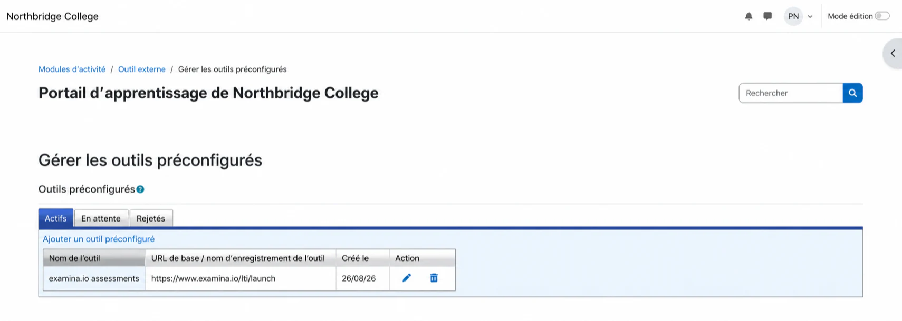

Retournez à examina.io et activez l'enregistrement. Un suspendu ou révoqué
l'inscription ne peut pas accepter de nouveaux lancements.

## 5. Ajouter une évaluation publiée à un cours Moodle {#5-add-a-published-assessment-to-a-moodle-course}

En tant qu'enseignant dans le cours de destination :

1. Activez le **mode Édition**.
2. Sélectionnez **Ajouter une activité ou une ressource** dans la section du cours souhaité.
3. Choisissez **Outil externe** ou les **évaluations examina.io** préconfigurées.
   outil.
4. Saisissez le nom de l'activité destinée à l'apprenant.
5. Sélectionnez **Sélectionner le contenu**.

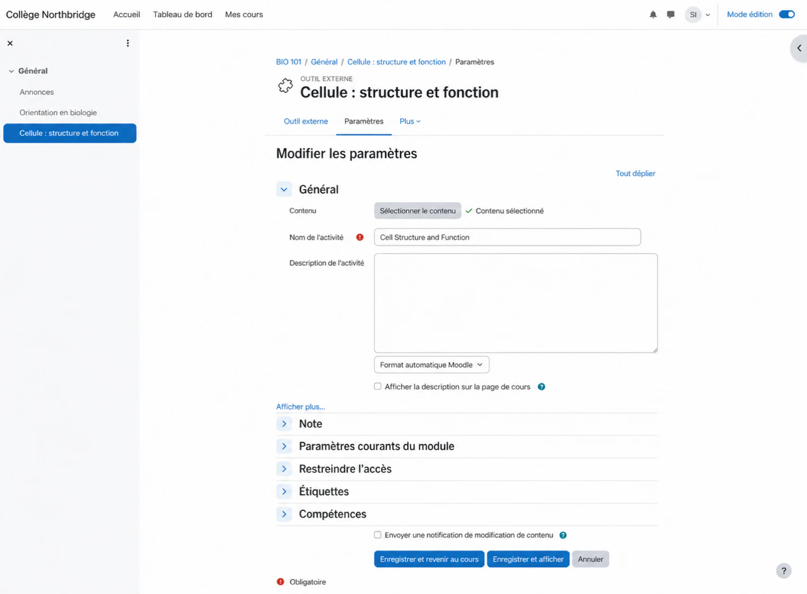

examina.io ouvre une liste d'évaluations publiées que l'instructeur peut utiliser.
Choisissez l’évaluation souhaitée et confirmez la sélection. Dans cet exemple, le
l'enseignant choisit **Structure et fonction cellulaire** pour **Introduction à la biologie**.

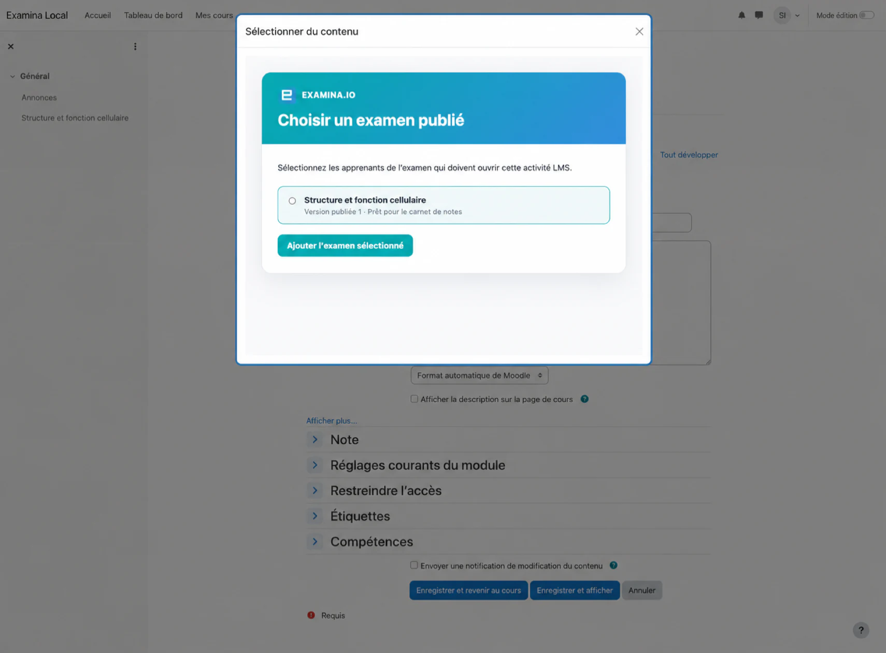

Enregistrez l'activité et ouvrez-la une fois en tant qu'enseignant. Confirmez que l'activité
affiche le titre correct de l'évaluation et ne demande pas de réponse distincte.
Nom d'utilisateur et mot de passe examina.io.

## 6. Vérifier l'expérience de l'apprenant {#6-verify-the-learner-experience}

Utiliser un apprenant fictif inscrit au cours pour validation :

1. Connectez-vous à Moodle en tant qu'apprenant.
2. Ouvrez le cours et sélectionnez l'activité d'évaluation.
3. Confirmez que l'examen attendu s'ouvre dans Moodle.
4. Complétez et soumettez l'évaluation.

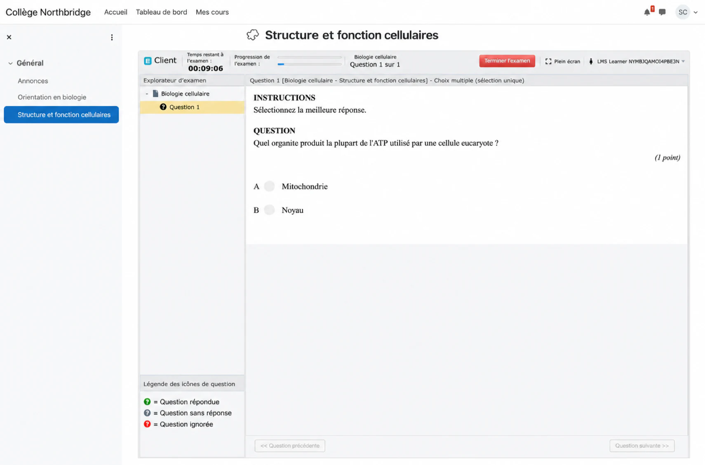

L'identité Moodle de l'apprenant, le cours, le placement d'activité et la sélection
Les évaluations publiées sont vérifiées lors du lancement du LTI. Une URL copiée à partir d'un
un cours ou un environnement différent ne remplace pas ce lancement.

## 7. Vérifiez la note renvoyée {#7-verify-the-returned-grade}

Une fois que l'apprenant a soumis, ouvrez **Notes → Rapport de notation** dans Moodle. Confirmer
que le résultat apparaisse sous l'activité et l'apprenant corrects.

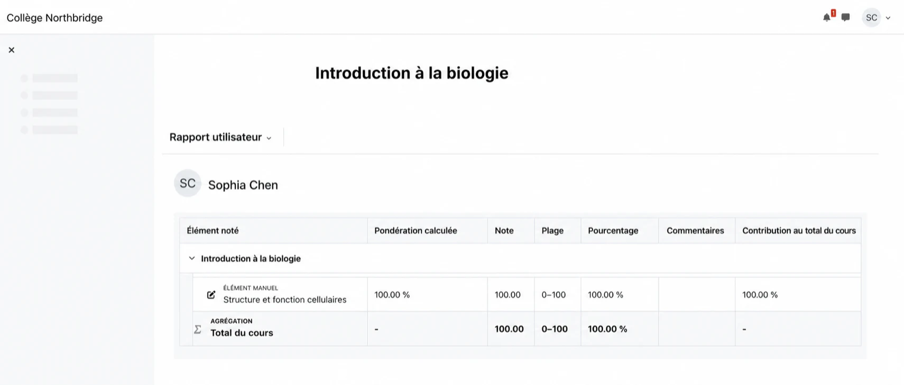

La remise des notes est mise en file d'attente séparément de la soumission de l'examen afin qu'un délai temporaire
La panne Moodle ne transforme pas une évaluation terminée en un échec de soumission.
Le résultat peut donc mettre un peu de temps à apparaître. Actualiser le carnet de notes
avant d'enquêter sur un résultat manquant.

## Liste de contrôle de validation de la production {#production-validation-checklist}

Avant d'activer l'outil pour un cours en direct, vérifiez tous les éléments suivants avec un
cours hors production et utilisateurs fictifs :

- L'outil Moodle est actif et utilise les points de terminaison finaux examina.io.
- L'enregistrement examina.io est actif dans la bonne organisation et
  environnement.
- Deep Linking répertorie uniquement les évaluations que l'enseignant est autorisé à sélectionner.
- L'activité sélectionnée lance l'évaluation publiée prévue.
- L'apprenant se lance à partir de Moodle sans deuxième connexion.
- Un score terminé atteint l'apprenant et l'élément de note corrects.
- La réouverture ou l'actualisation de l'activité ne crée pas d'éléments de note en double.
- NRPS est désactivé lorsque l'accès à la liste de cours n'est pas nécessaire.
- Les deux applications utilisent des URL HTTPS publiques et des certificats de confiance.

## Dépannage {#troubleshooting}

| Symptôme | Que vérifier |
| --- | --- |
| **Sélectionner le contenu** est manquant | Confirmez que l'outil est actif, que le Deep Linking est activé dans les deux systèmes, que l'URL du Deep Linking est présente et que l'utilisateur Moodle actuel peut ajouter des activités. |
| L'activité ouvre une page blanche ou le lancement est refusé | Vérifiez l'émetteur, l'ID client, l'ID de déploiement, l'URL de connexion OIDC, l'URL de lancement, le certificat HTTPS, la politique iframe et les restrictions relatives aux cookies tiers du navigateur. Assurez-vous qu’aucun Docker interne ou nom d’hôte privé n’apparaît dans une URL visible dans le navigateur. |
| La mauvaise évaluation s'ouvre | Modifiez l'activité Moodle et sélectionnez à nouveau l'évaluation publiée. Ne copiez pas une activité entre environnements sans resélectionner son contenu. |
| La note n'apparaît pas | Confirmez que AGS et l'acceptation des notes sont activés dans Moodle, que le **Retour de notes** est activé dans examina.io et que l'activité comporte un élément de note. Prévoyez un court délai pour la livraison en file d'attente. |
| La liste des cours n'est pas disponible | Confirmez que NRPS est activé et accordé dans Moodle. Le lancement de l’évaluation et le retour des notes peuvent se poursuivre sans accès à la liste. |
| Moodle signale une erreur de clé ou de signature | Confirmez que Moodle utilise l'URL examina.io JWKS spécifique à l'enregistrement, que examina.io utilise l'URL de clé publique actuelle de Moodle, que les deux horloges sont exactes et qu'aucun point de terminaison ne redirige vers une page de connexion. |

Pour connaître la terminologie côté plate-forme et les menus actuels de Moodle, consultez le site officiel.
[Outils externes](https://docs.moodle.org/502/en/LTI_External_tools) et
[Outil externe FAQ](https://docs.moodle.org/502/en/LTI_External_tool_FAQ)
documentation.
