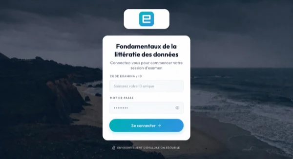
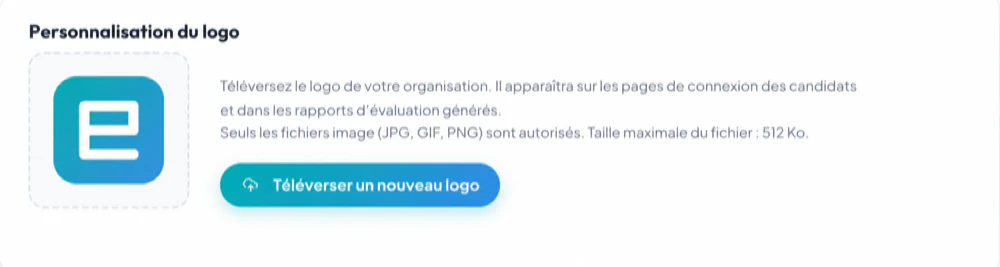
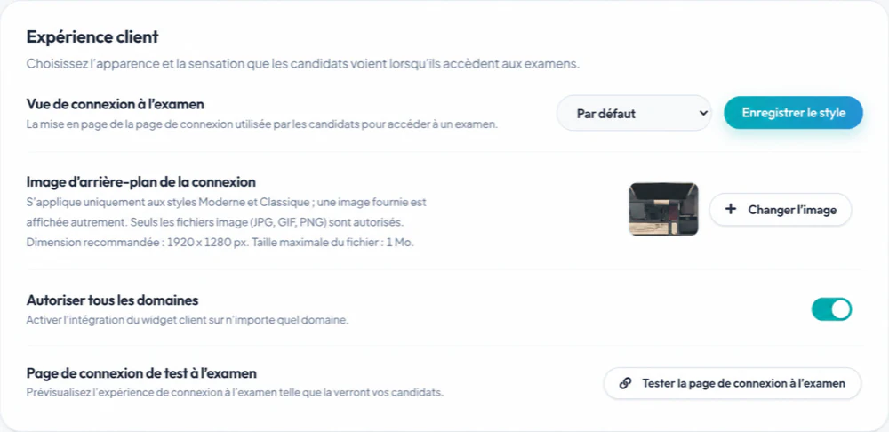

# Personnaliser la page de connexion à l'examen {#customize-the-exam-login-page}

Les comptes racine et administrateur peuvent configurer un style de connexion à l'échelle de l'organisation,
logo et arrière-plan depuis **Accueil → Paramètres**. La disponibilité peut dépendre du
le plan de l’organisation.

## Choisissez un style {#choose-a-style}

Le client propose trois styles :

1. **Par défaut**
2. **Moderne**
3. **Classique**

Par défaut, prend en charge la personnalisation spécifique aux examens créée dans Designer. Moderne et classique
utilisez le logo et l’image d’arrière-plan de l’organisation.

Classic applique un traitement visuel sur l'arrière-plan pour préserver le contraste
autour des champs de connexion. Vérifiez l'image finale dans les deux styles plutôt que
en supposant qu'ils seront identiques.

## Télécharger le logo d'une organisation {#upload-an-organization-logo}

1. Connectez-vous en tant que root ou administrateur.
2. Ouvrez **Accueil → Paramètres**.
3. Dans **Personnalisation du logo**, sélectionnez **Télécharger un nouveau logo**.
4. Choisissez un fichier JPG, GIF ou PNG ne dépassant pas 512 Ko.
5. Attendez la fin du téléchargement.

Si aucun logo n'est défini, le nom de l'organisation peut apparaître à sa place. Utiliser un logo
avec un rembourrage clair et suffisamment de contraste pour la lumière et la photographie
arrière-plans.

## Sélectionnez un style de connexion {#select-a-login-style}

1. Recherchez **Expérience client**.
2. Sous **Vue de connexion à l'examen**, choisissez Par défaut, Moderne ou Classique.
3. Sélectionnez **Enregistrer le style**.

Le changement s'applique au niveau de l'organisation. Coordonnez-le avec n'importe qui
exécuter un examen actif avant de changer de style.

## Télécharger un arrière-plan {#upload-a-background}

1. Sous **Image d'arrière-plan de connexion**, sélectionnez **Modifier l'image**.
2. Choisissez un fichier JPG, GIF ou PNG.
3. Utilisez les dimensions recommandées affichées (1 920 × 1 280 pixels) et restez dans les limites.
   la limite de taille de fichier affichée.
4. Attendez la fin du téléchargement.

Moderne et Classique peuvent utiliser un arrière-plan fourni lorsqu'aucune image personnalisée n'est définie.
Sélectionnez le petit aperçu pour inspecter l’arrière-plan actuel dans une taille plus grande.

## Testez le résultat {#test-the-result}

Si au moins un examen est disponible, sélectionnez **Page de connexion à l'examen de test**. Vérifiez :

- taille et netteté du logo ;
- contraste du texte ;
- le formulaire de connexion sur les largeurs desktop et mobile ;
- mise au point du clavier et lisibilité sur le terrain ;
- temps de chargement sur une connexion plus lente ; et
- si l'identité correcte de l'organisation est indubitable.

Ouvrez le test dans une fenêtre de navigateur privée pour voir l'expérience du candidat
sans compter sur la session administrateur.

## Guidage par images {#image-guidance}

- Évitez le texte intégré en arrière-plan ; il peut être recadré ou masqué.
- Gardez le focus visuel loin du formulaire de connexion.
- Compressez les grandes photos avant de les télécharger.
- Utilisez des images que votre organisation est autorisée à publier.
- Ne placez pas les noms des candidats, les questions d'examen ou d'autres données confidentielles dans
  atouts de marque.

Pour le reste des paramètres de l'organisation, voir [Paramètres de l'organisation et
marque](../administration/organization-settings.md).
