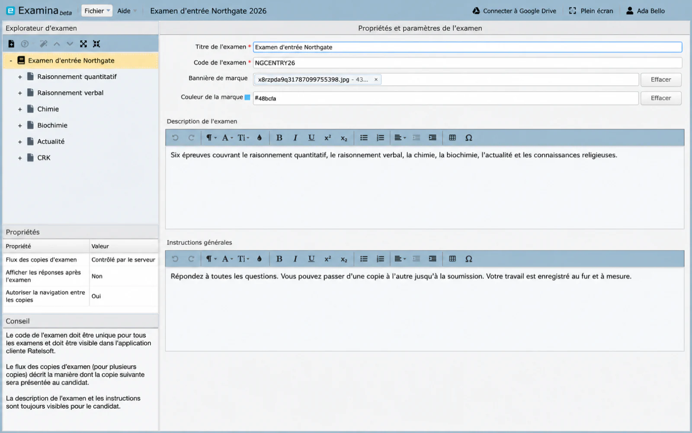

# L'examen {#the-exam}

Sélectionnez un examen dans Exam Explorer et le volet d'édition affiche tout ce qui
s'applique à l'examen dans son ensemble. La majeure partie est visible par le candidat.
cela vaut la peine d'être délibéré ici plutôt que de le remplir pour passer l'écran.

## Titre de l'examen {#exam-title}

Le nom que le candidat voit lorsqu’il passe l’examen. Écrivez-le comme vous le feriez
imprimez-le sur un papier : *Northgate Entry Examination*, et non *entrance-final-v2*.

!!! note "À propos des exemples"
    Les captures d'écran des pages Designer utilisent un exemple de projet,
    **Examen d'entrée Northgate 2026**, contenant un seul examen appelé
    *Examen d'entrée Northgate* avec six épreuves. Là où ce guide nomme un
    valeur du champ, c'est la valeur visible dans cet échantillon.

## Code d'examen {#exam-code}

**Obligatoire et champ le plus susceptible de causer des problèmes ultérieurement.**

Le code identifie l'examen lorsqu'il atteint Manager, il doit donc être unique
pour chaque examen importé par votre organisation. Deux examens partageant un code ne peuvent pas
les deux doivent être importés proprement.

Deux règles que le champ applique :

- **Pas d'espace**
- **Lettres et chiffres uniquement** — pas de ponctuation, de tirets ou de traits de soulignement

`NGCENTRY26` convient et constitue le code utilisé dans l'exemple. `NGC ENTRY 26` et
Les `NGC-ENTRY-26` ne le sont pas.

!!! tip "Décidez d'un programme avant votre deuxième examen, pas votre vingtième"
    Quelque chose comme `SUBJECT` + `YEAR` + `SITTING` reste lisible et reste
    uniques : `NGCENTRY26`, `NGCMOCK26`. Moderniser un système signifie réimporter
    examens déjà utilisés.

## Bannière et couleur de marque {#branding-banner-and-colour}

Facultatif. La bannière apparaît au candidat pendant qu'il passe l'examen, et le
la couleur teinte l’interface environnante.

Utilisez-les lorsqu'une seule organisation propose des examens pour le compte de plusieurs
départements ou clients, et chacun doit ressembler au sien. **Effacer** supprime
l'un ou l'autre sans affecter l'autre.

## Description {#description}

Montré au candidat avant de commencer, et la première chose est un candidat nerveux
lit. Dites ce qu'**est** l'examen et ce qu'il **couvre**, dans un langage simple.

Éléments utiles à mettre ici :

- à quoi sert l'examen — entrée, fin de module, pratique
- quels sujets ou sujets il couvre et combien d'articles
- approximativement combien de temps dure toute la séance
- ce que signifie un laissez-passer, si cela est décidé à l'avance

L'exemple utilise :

> Six articles couvrant le raisonnement quantitatif, le raisonnement verbal, la chimie,
> biochimie, actualité et savoir religieux.

Évitez de reformuler le titre de l'examen et évitez les références internes comme la version
numéros ou codes de comité. Le candidat ne peut pas agir en conséquence.

## Instruction générale {#general-instruction}

Également affiché avant le début de l’examen. C'est pour les règles de la salle : les choses
le candidat doit savoir comment passer l'examen correctement, en postulant dans **chaque**
papier.

Éléments utiles à mettre ici :

- s'ils doivent répondre à toutes les questions ou s'ils peuvent choisir
- s'ils peuvent se déplacer entre les journaux et s'ils peuvent revenir
- ce qui est autorisé : calculatrice, notes, papier brouillon
- que se passe-t-il si la connexion est interrompue ou si le navigateur se ferme
- comment signaler un problème lors de l'examen
- si le travail est sauvegardé au fur et à mesure

L'exemple utilise :

> Répondez à chaque question. Vous pouvez passer d'un article à l'autre jusqu'à ce que vous les soumettiez. Votre travail
> est enregistré au fur et à mesure.

Cette dernière phrase fait plus qu'elle n'en a l'air : les candidats qui ne connaissent pas leur
les réponses sont enregistrées évitera de naviguer et passera l'examen anxieux
sur la perte de travail.

!!! tip "Dites ce qui se passe quand les choses tournent mal"
    L’instruction qui mérite le plus d’être incluse est celle que personne n’écrit : que faire si
    la connexion est interrompue. Un candidat qui sait qu’il peut réintégrer le groupe le rejoindra. Un
    celui qui ne le fait pas peut abandonner.

Les instructions par papier appartiennent plutôt à [le papier](paper.md) — timing,
choix de questions et tout ce qui s'applique à un seul sujet. Tout ce que tu
autrement, je répéterais sur chaque papier appartient ici.

## Flux de documents d'examen {#exam-paper-flow}

Pour les examens comportant plus d’une épreuve, cela détermine la manière dont l’épreuve suivante arrivera.

| Paramètre | Comportement |
|---|---|
| **Contrôlé par le serveur** | Le serveur décide quand chaque journal s'ouvre. Tout le monde bouge ensemble |
| **Contrôlé par le client** | Le candidat continue lorsqu'il a terminé l'épreuve en cours |
| **Forcer en continu** | Les journaux se succèdent sans interruption |

Choisissez **Server Controlled** pour une séance où tout le monde doit être assis au même endroit.
papier en même temps. Choisissez **Contrôlé par le client** lorsque les candidats doivent
travailler à leur rythme dans un délai global.

## Afficher les réponses après l'examen {#show-answers-after-exam}

Si le candidat voit quelles réponses étaient bonnes une fois soumis.

Utile pour les tests pratiques et la révision. Presque toujours mauvais pour un live
évaluation, car elle remet le corrigé à tous ceux qui s'assoient tôt.

## Autoriser la navigation inter-papier {#allow-inter-paper-navigation}

Si un candidat peut revenir à un article qu'il a déjà quitté.

Définissez sur **Non** lorsque chaque document est censé être scellé une fois soumis. Régler sur
**Oui** lorsque l'examen dans son ensemble est en réalité une longue épreuve divisée en parties et
les candidats devraient être libres de revenir.

## Avant de passer à autre chose {#before-you-move-on}

Le code de l'examen est le seul paramètre qu'il est vraiment difficile de modifier plus tard,
car c'est ainsi que Manager reconnaît l'examen. Tout le reste peut être modifié et
réexporté sans conséquence.

Suivant : [Le papier](paper.md).
