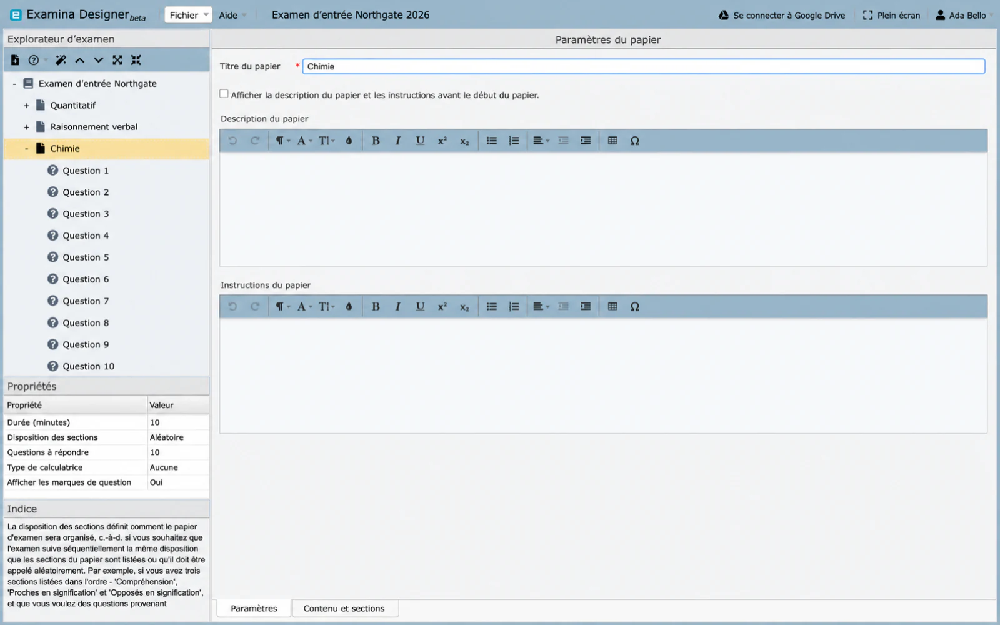

# Créer et configurer un papier {#create-and-configure-a-paper}

Une épreuve est une unité chronométrée dans un examen. Il peut représenter un sujet, un cours,
module ou un autre segment d’évaluation. Un examen peut contenir plusieurs épreuves.

## Créer un papier {#create-a-paper}

1. Créez ou ouvrez un projet d'examen.
2. Cliquez avec le bouton droit sur l'examen dans **Exam Explorer**.
3. Sélectionnez **Nouvelle épreuve d'examen**.
4. Sélectionnez le nouveau papier, tel que **Papier 1**.
5. Complétez ses propriétés.

Les titres des épreuves doivent être uniques au sein de l’examen.

## Propriétés du papier {#paper-properties}

**Titre du papier**

: Le nom du candidat, tel que Mathématiques, Aptitude ou Biologie 201.

**Description et instructions**

: Facultatif, sauf si **Afficher la description et les instructions avant le début du papier** est
  activé. Expliquer le timing, le choix, la calculatrice ou la navigation spécifiques au papier
  règles.

**Durée du papier**

: Le temps autorisé en minutes. La durée minimale est de cinq minutes.

**Disposition des sections**

: Contrôle si les sections sont présentées séquentiellement ou sélectionnées dans un
  ordre aléatoire.

**Questions à répondre**

: Définit le nombre de questions que le client présente à partir du pool disponible. Utilisez ceci pour
  tirez un sous-ensemble aléatoire d’une banque de questions plus grande.

Définissez la valeur des questions à répondre une fois la création terminée. Ajouter des questions
plus tard, vous pourrez le réinitialiser au nombre total de questions de l'article, alors vérifiez-le à nouveau
avant l'exportation.

**Type de calculatrice**

 : n'autorise aucune calculatrice ni l'une des calculatrices Simple, Advanced ou Base prises en charge.
  calculatrices.

**Afficher les points d'interrogation**

: contrôle si la valeur de score attribuée à chaque question est visible par le
  candidat.

## Sections et contenu {#sections-and-content}

Ouvrez **Contenu et sections** pour créer des sections et définir :

- l'ordre des sections ;
- des questions séquentielles ou randomisées au sein d'une section ; et
- combien de questions sont sélectionnées dans chaque section.

Par exemple, un article de langue peut contenir des éléments d'expression orale, de compréhension et de vocabulaire.
sections dans un ordre fixe tout en randomisant les questions à l’intérieur de chaque section.

## Réutiliser les questions {#reuse-questions}

Pour dupliquer le contenu existant dans le projet ouvert, copiez une question et collez-la
dans le papier de destination. Voir [Réutiliser le contenu du projet](importing-questions.md)
pour le flux de travail pris en charge. Pour extraire des questions d'un document ou d'un autre
projet, cliquez avec le bouton droit sur le papier et voyez [Importer un document existant
contenu](import-content.md).

## Valider le papier {#validate-the-paper}

- Le titre est unique et reconnaissable.
- Durée et consignes d'accord.
- L'ordre des sections et la randomisation sont intentionnels.
- Le nombre de questions-réponses ne dépasse pas le pool disponible.
- Les paramètres de la calculatrice et de l'affichage des scores sont appropriés.
- Chaque question a été prévisualisée.

Continuez avec [Création de questions](questions.md).
