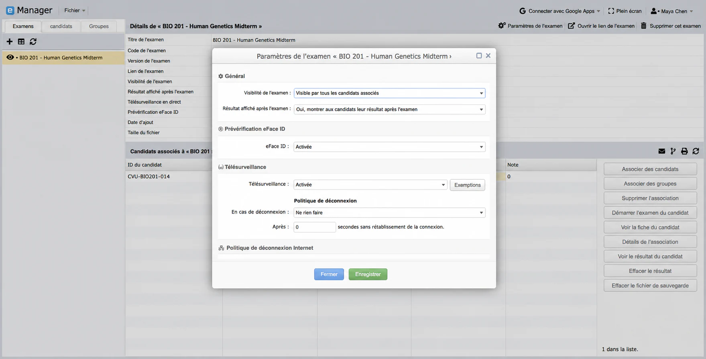
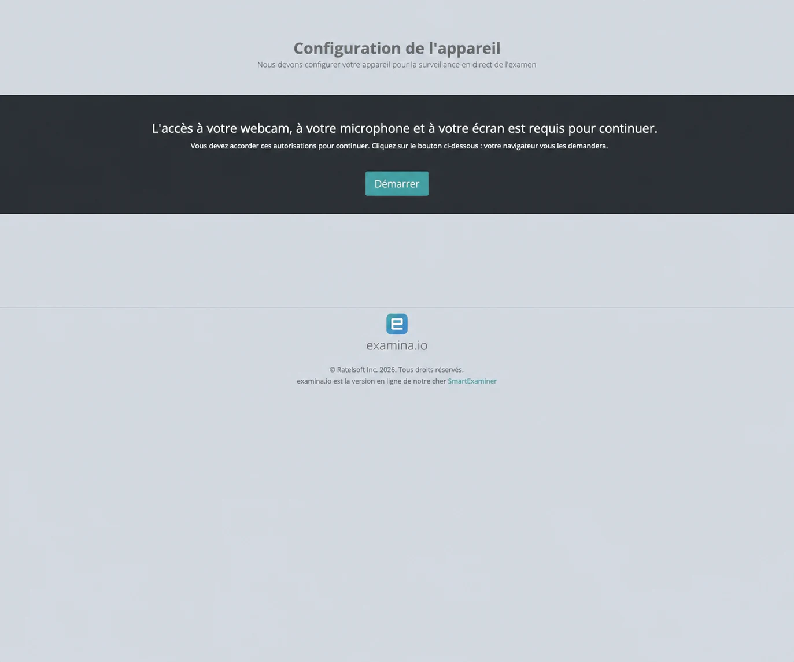
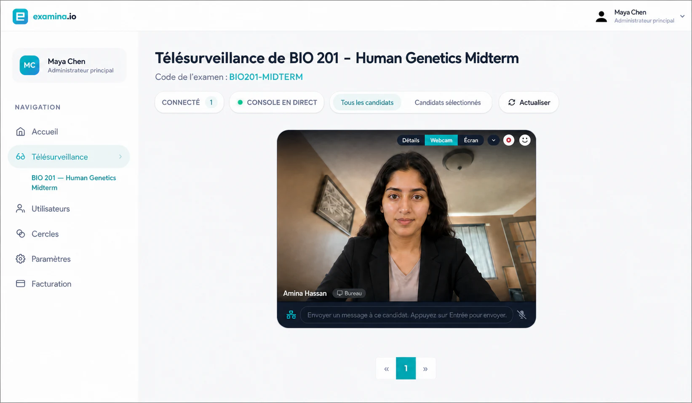
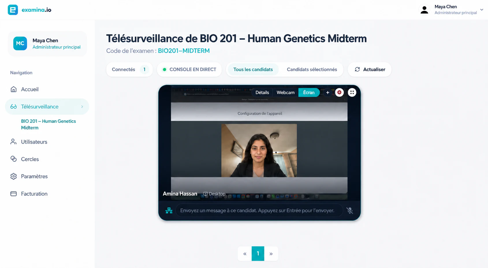
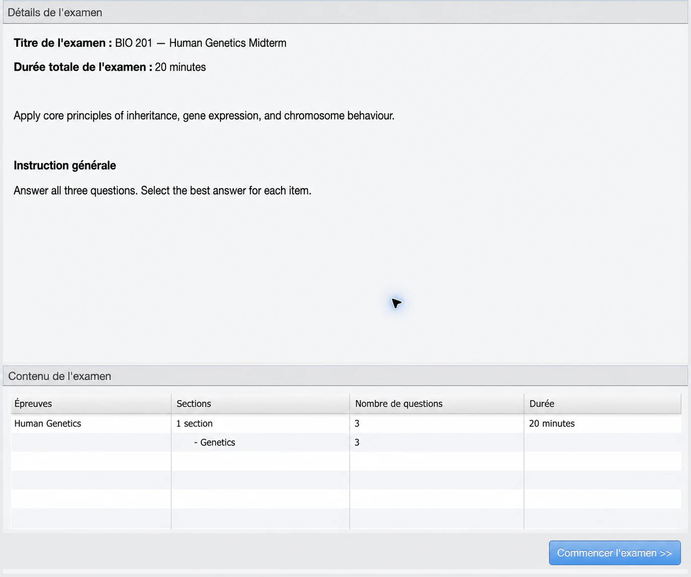
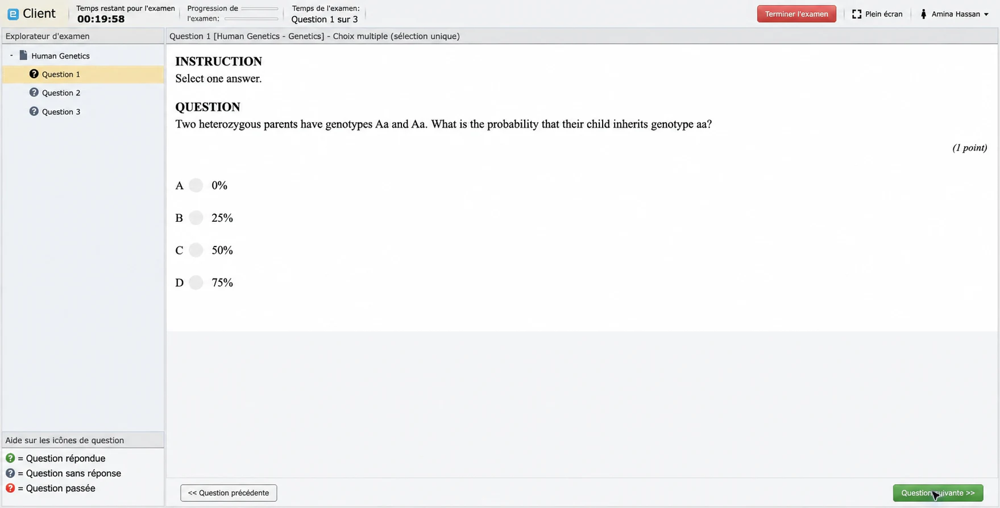
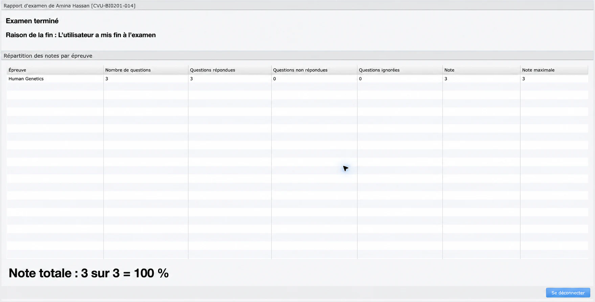

# Organiser un examen surveillé en direct

La surveillance en direct permet à un surveillant autorisé de voir la webcam
et l’écran partagé, d’envoyer des messages, d’autoriser le démarrage et de
suivre la session dans la console Examina.

Ce guide utilise **Cedar Valley University**, **Amina Hassan** et **BIO 201 —
Human Genetics Midterm**.

## Avant le jour de l’examen

Vérifiez les affectations, les sujets, la durée, la fenêtre de démarrage, les
instructions et la visibilité des résultats. Activez **Surveillance en
direct** et, si nécessaire, **Vérification eFaceID**. Donnez aux surveillants
le bon rôle et l’accès au Cercle.

Le candidat utilise un ordinateur avec caméra, microphone, navigateur récent,
partage d’écran et connexion stable. Le surveillant utilise un autre ordinateur
et une autre session. En production, utilisez HTTPS : une adresse HTTP de
réseau local ne peut pas demander les autorisations multimédias du navigateur.

### Configurer l’évaluation

Vérifiez les affectations, les horaires, les consignes et les autorisations.

### Préparer les appareils et les réseaux

Effectuez une répétition complète avec un candidat fictif avant l’examen.

## 1. Configuration de l’appareil

Après la connexion et, le cas échéant, le parcours
[eFaceID](efaceid-identity-verification.md), le candidat voit **Configuration
de l’appareil**.

Il choisit **Démarrer**, autorise la caméra et le microphone, puis partage
l’onglet de l’examen ou l’écran prévu. Fermez auparavant les fenêtres et
notifications privées.

!!! warning "Ne partagez pas de contenu privé"

    Fermez les fenêtres et notifications sans rapport avec l’examen. Si votre
    politique le permet, partagez seulement l’onglet de l’examen.

## 2. Ouvrir la console de surveillance

Le surveillant ouvre l’examen sous **Surveillance**, puis, dans le menu du
candidat, choisit **Demander les flux audio et vidéo du candidat**. Il autorise
le microphone du navigateur et attend l’établissement de la connexion.

Actualisez la console après une reconnexion avant d’envoyer une nouvelle
demande de flux.

## 3. Vérifier la webcam et l’écran

Sous **Webcam**, confirmez l’identité attendue, l’éclairage, l’angle et
l’absence d’une autre personne.

Sous **Écran**, confirmez que l’examen ou l’affichage prévu est partagé.

Les images utilisent une candidate fictive pour protéger la vie privée tout en
conservant l’état réel de la console testée.

## 4. Autoriser le démarrage

Après les contrôles, ouvrez le menu du bon candidat et choisissez **Autoriser
le démarrage**. Vérifiez le message de réussite. Le candidat reçoit
**Configuration terminée** et contrôle le titre, la durée, les instructions,
les sujets et le nombre de questions.

## 5. Surveiller et terminer

La surveillance continue pendant que le candidat répond dans Client.

Surveillez l’état de connexion, intervenez uniquement si nécessaire, consignez
les incidents selon votre politique et distinguez une panne d’un comportement
irrégulier. Ne collectez pas de contenu personnel sans rapport avec l’examen.

Le candidat choisit **Terminer l’examen** et confirme l’envoi. Vérifiez ensuite
dans Manager les questions répondues, non répondues et ignorées, ainsi que le
score obtenu et le score possible.

## 6. Terminer la session

Le candidat confirme l’envoi ; le surveillant attend la fin ou la déconnexion
normale des flux avant de fermer la console.

## 7. Vérifier le résultat

Dans Manager, vérifiez l’état final, les réponses, le score et la résolution
de tout incident consigné.

## Incidents fréquents

**Écran vide** : arrêtez le partage, partagez de nouveau l’onglet ou l’écran de
l’examen, actualisez la console et redemandez les flux.

**En attente du flux** : confirmez HTTPS ou localhost, les autorisations, le
bouton **Démarrer** côté candidat et la demande de flux côté surveillant.

**Nouvelle autorisation système** : relancez le navigateur si le système
d’exploitation le demande.

**Changement de navigateur** : fermez correctement l’ancienne session ou
attendez l’expiration de sa présence ; eFaceID peut devoir être répété.

**Perte de connexion** : conservez la tentative, rétablissez le réseau et
appliquez la politique de déconnexion. Ne supprimez pas un résultat comme
simple méthode de récupération.

## Liste de contrôle

- Surveillant connecté sur un ordinateur distinct.
- Bon examen ouvert sous **Surveillance**.
- Identité et photo vérifiées si eFaceID est utilisé.
- Caméra, microphone et écran autorisés.
- Webcam et écran contrôlés avant l’autorisation.
- Bon candidat autorisé explicitement.
- Résultat final vérifié dans Manager.
