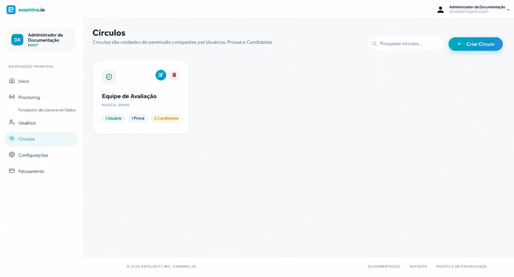

# Funções de usuário e permissões

Os membros da equipe fazem login como **Users**. Cada User possui uma função de conta que controla quais áreas do aplicativo estão disponíveis. Em seguida, os **Circles** restringem o acesso a exames e candidatos específicos.

Os candidatos não precisam de contas de User para a equipe; eles entram por meio de um link de exame com suas credenciais de candidato.

## Funções de conta

| Função | Use para | Acesso típico |
| --- | --- | --- |
| **Root** | O proprietário principal da organização | Administração da organização, Users, Circles, Settings, faturamento, workspaces do Designer, Manager e do Proctor elegíveis |
| **Administrator** | Administradores de confiança da plataforma | Users, Circles, Settings, workspaces do Designer, Manager e do Proctor elegíveis; sem acesso ao faturamento da organização |
| **Regular** | Autores de questões, coordenadores de exames e outros membros da equipe operacional | Designer e Manager para recursos permitidos por meio de Circles; podem visualizar Circles relevantes e usar workspaces do Proctor elegíveis |
| **Invigilator** | Membros da equipe que apenas supervisionam exames ativos | Fiscalização de provas para exames atribuídos e habilitados |

Como as contas Root e Administrator podem gerenciar outros membros da equipe e as configurações da organização, atribua-as com moderação.

## Como os Circles afetam o acesso

Um Circle contém três tipos de membros:

- **Users** que recebem acesso;
- **Exames** com os quais podem trabalhar; e
- **Candidatos** que podem visualizar ou gerenciar.

Por exemplo, um Circle `BIO-201` poderia conter o coordenador do curso e os fiscais de prova, o exame parcial e os alunos matriculados. A equipe fora desse Circle não ganharia acesso apenas por possuir uma conta Regular.

## Modelo de função recomendado

- Mantenha uma ou duas contas Root cuidadosamente protegidas.
- Use Administrator para pessoas que mantêm Users, Settings da organização ou a estrutura de Circles.
- Use Regular para o trabalho diário de autoria e gerenciamento de exames.
- Use Invigilator quando uma pessoa só precisar do workspace do Proctor.
- Crie Circles em torno de limites de responsabilidade estáveis, como um curso, departamento, cliente ou programa de exames.
- Revise e remova o acesso quando um membro da equipe mudar de responsabilidade.

## Lista de verificação de permissões

Antes de um exame:

1. Confirme se cada membro da equipe possui a função mais baixa necessária para sua função.
2. Confirme se o exame e seus candidatos estão no Circle pretendido.
3. Confirme se cada User operacional está nesse Circle.
4. Se a fiscalização de provas estiver habilitada, confirme se os fiscais atribuídos conseguem ver o exame.
5. Teste com uma conta que não seja de administrador para verificar o limite pretendido.

Para instruções de configuração, consulte [Users e funções de conta](../user-guides/administration/users-and-roles.md) e [Circles e permissões](../user-guides/administration/circles-and-permissions.md).
