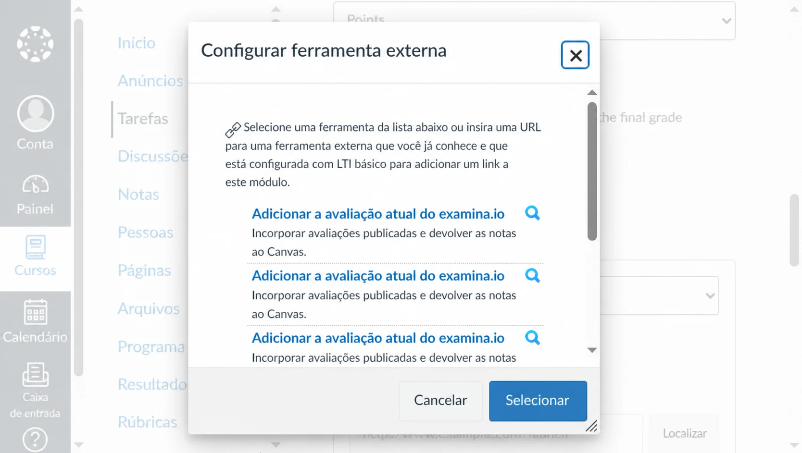
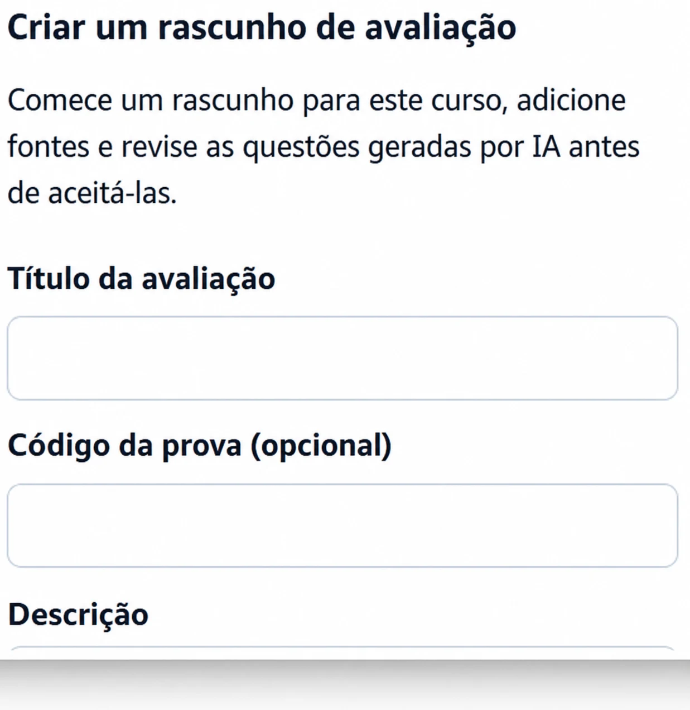
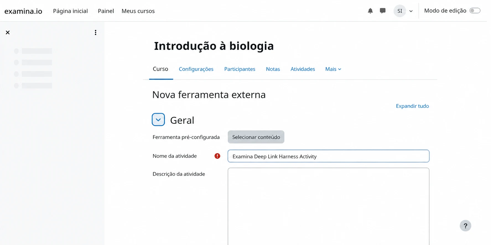
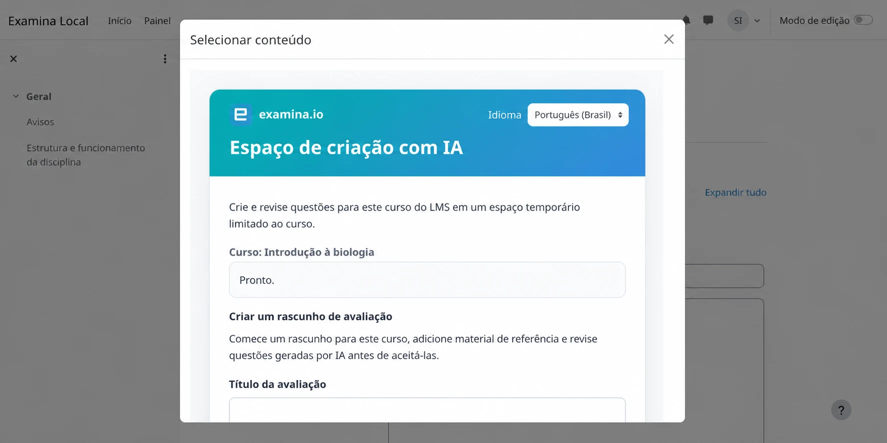
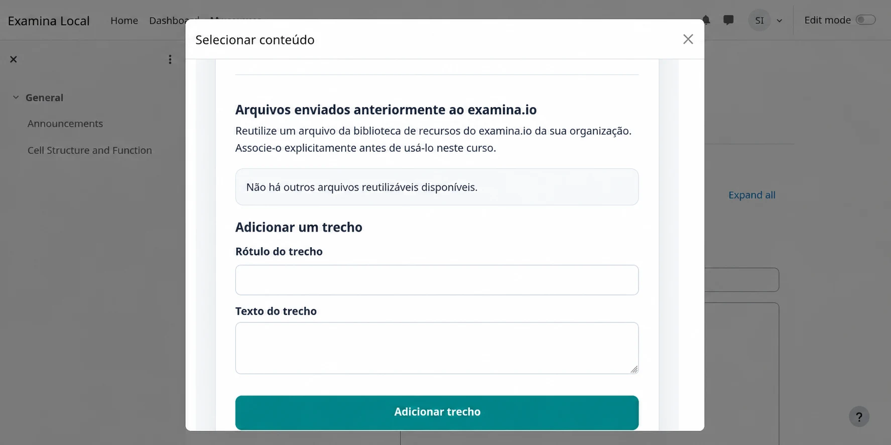
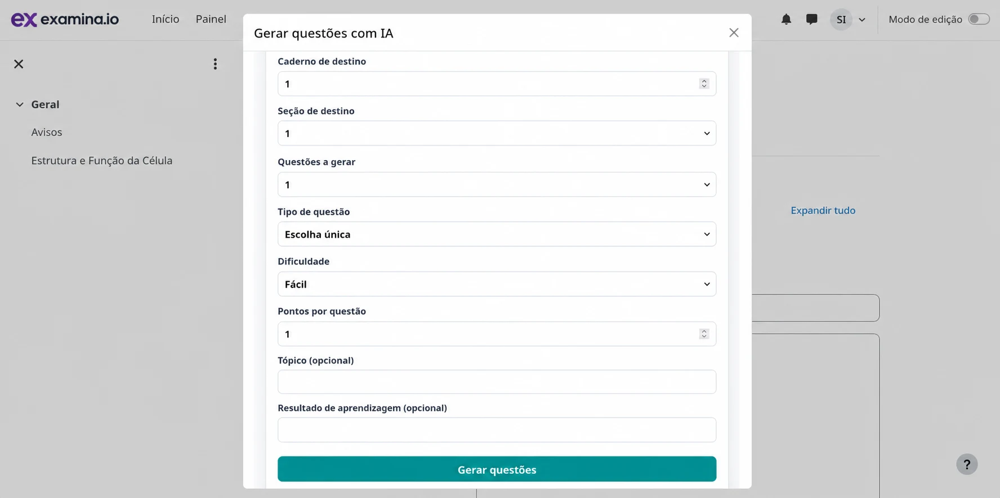
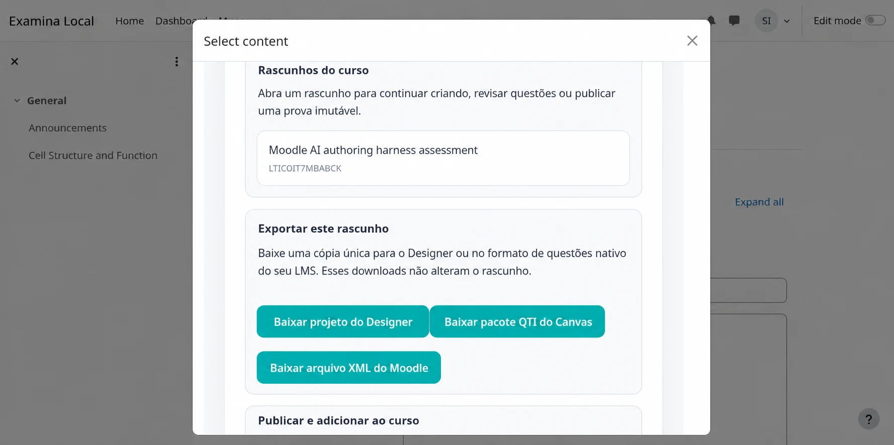
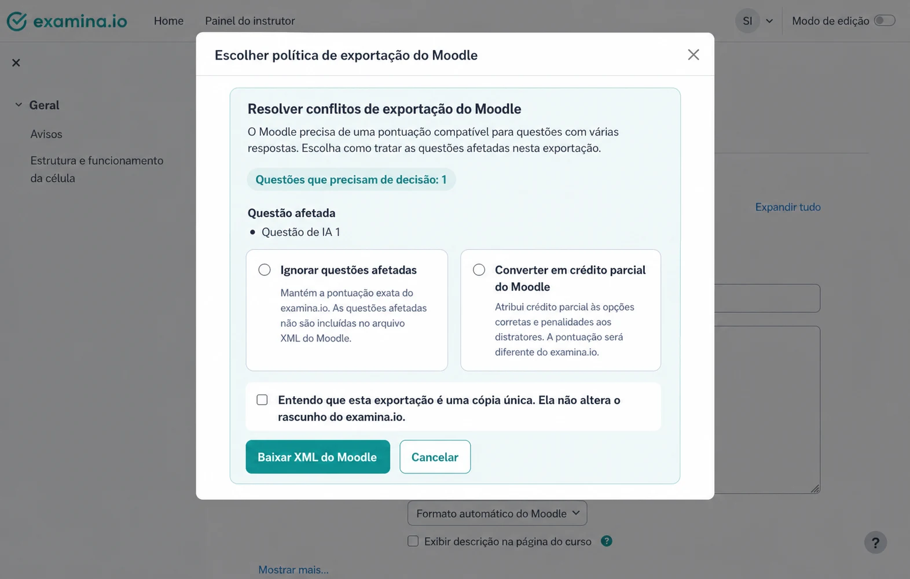

# Criar questões com IA a partir do Canvas ou Moodle

Os professores podem abrir o examina.io em um curso do Canvas ou Moodle, criar
com IA um rascunho de questões baseado em fontes e devolver uma prova publicada
ao curso. O mesmo rascunho também pode gerar uma cópia pontual para o Designer
ou um arquivo nativo para o banco de questões do LMS.

Este guia cobre todo o fluxo do professor. Antes, um administrador do LMS deve
concluir a [configuração LTI 1.3 do Canvas](canvas-lms.md) ou a
[configuração LTI 1.3 do Moodle](moodle-lms.md), incluindo o **Deep Linking**.

!!! tip "Valide primeiro em um curso de teste"

    Use conteúdo e usuários fictícios para validar a criação, exportação,
    publicação, abertura pelo aluno e retorno de notas antes de uma prova real.

Os exemplos usam um curso fictício de **Introdução à Biologia (BIO 101)** e um
rascunho chamado **Avaliação de estrutura e função celular**.

## Entender rascunhos e saídas

O espaço de criação mantém um único rascunho canônico no examina.io. A geração,
revisão e alteração das fontes atualizam esse rascunho até a publicação.

| Saída | Finalidade | Relação com o rascunho |
| --- | --- | --- |
| Rascunho do examina.io | Continuar a criação com IA e a revisão | Mutável e armazenado no servidor |
| `.smex` | Aplicar a prova final | Imutável, final e armazenado no servidor após a publicação |
| `.smexproj` | Continuar a edição avançada no Designer v3 | Cópia local única; salvar no Designer não atualiza o rascunho do servidor |
| ZIP QTI do Canvas | Importar questões compatíveis em um banco clássico do Canvas | Cópia nativa única |
| Moodle XML | Importar questões compatíveis em um banco do Moodle | Cópia nativa única |

A publicação é um limite: ela cria o `.smex` imutável usado pelos alunos.
Exportar um projeto ou arquivo do LMS não publica nem altera o rascunho.

## Antes de começar

Confirme que:

- o examina.io aparece como Ferramenta externa no curso;
- o registro tem o Deep Linking ativado;
- você é professor, designer do curso ou administrador autorizado a adicionar
  atividades no LMS;
- sua conta tem espaço dentro do limite de rascunhos ativos; e
- os arquivos de origem são PDF, DOCX, TXT ou HTML.

Itens `DRAFT` e `PUBLISHING` contam para o limite. Publicar ou excluir um
rascunho libera seu espaço. Se o ambiente informar que o limite foi atingido,
conclua um rascunho existente ou peça a um administrador do examina.io para
retirar um. A exclusão é atualmente uma operação administrativa/API; ela não
aparece na tela de criação do LMS nem no Designer.

## 1. Abrir a criação com IA a partir do LMS

### Canvas

1. Abra o curso e selecione **Tarefas**.
2. Crie ou edite uma tarefa e escolha **Ferramenta externa** como tipo de envio.
3. Selecione **Localizar**, escolha **examina.io** e abra o seletor de conteúdo.

Escolha **Criar questões com IA**, informe **Avaliação de estrutura e função
celular** e crie o rascunho. Se você já iniciou um neste curso, também pode
abri-lo na lista de rascunhos.

### Moodle

1. Ative o **Modo de edição** no curso.
2. Selecione **Adicionar uma atividade ou recurso** e **Ferramenta externa**.
3. Escolha a ferramenta examina.io configurada e selecione **Selecionar
   conteúdo**.

Escolha **Criar questões com IA** ou reabra um rascunho do curso.

### Alterar o idioma do espaço de trabalho

Use o menu de idioma no topo de qualquer página LTI do examina.io para escolher
inglês, francês, árabe, espanhol latino-americano ou português brasileiro. O
árabe usa uma interface da direita para a esquerda. O menu altera instruções e
controles, mas nunca traduz passagens, questões ou respostas enviadas.

## 2. Criar a estrutura do rascunho

Informe um título reconhecível e, se necessário, um código interno. Neste
exemplo, use:

- **Título:** Avaliação de estrutura e função celular
- **Código:** BIO-101-CELL
- **Caderno:** Caderno 1
- **Seção:** Organelas celulares
- **Instrução:** Responda a todas as questões usando o texto fornecido.

Em telas amplas, o espaço separa fontes e questões em duas colunas; em telas
menores, elas são empilhadas.

## 3. Adicionar um ou vários arquivos de origem

Selecione **Adicionar textos e arquivos** e arraste vários arquivos para a área
de envio ou escolha-os pelo seletor. Os arquivos selecionados aparecem juntos
antes do envio para que você possa remover uma escolha acidental.

Para um exemplo rápido, envie um texto curto que explique:

> Os cloroplastos capturam energia luminosa para produzir açúcares, enquanto as
> mitocôndrias liberam energia utilizável desses açúcares. As células vegetais
> contêm ambas as organelas.

Use apenas material que sua instituição esteja autorizada a processar.
Certifique-se de que cada arquivo terminou de ser processado antes de gerar
questões. Uma fonte já enviada permanece vinculada ao rascunho no servidor
quando ele é reaberto pelo Canvas ou Moodle.

## 4. Gerar questões

Selecione **Gerar questões com IA** e escolha o caderno e a seção de destino. O
examina.io gera atualmente:

- questões de escolha única;
- questões de múltipla escolha; e
- questões de preencher lacuna.

No exemplo, crie duas questões de escolha única, dificuldade média e 2 pontos
cada, e depois uma questão de múltipla escolha média. Defina **Organelas
celulares** como tópico e **Distinguir a captura de energia de sua liberação nas
células vegetais** como resultado de aprendizagem.

O resultado da IA pode estar errado ou ser inadequado. O professor continua
responsável por verificar precisão, gabaritos, ambiguidades, dificuldade,
acessibilidade, direitos autorais e alinhamento com o objetivo pedagógico.

## 5. Revisar as propostas geradas

Compare cada proposta com a fonte. Mantenha as boas questões e rejeite as
ruins. O espaço simplificado do LMS permite selecionar questões e ajustar o
título e a instrução ao aluno; ele não é um editor completo de enunciados e
respostas.

Quando uma edição extensa for necessária, rejeite e gere novamente ou baixe um
projeto do Designer para edição local avançada. Um projeto aberto no Designer é
uma cópia fixada em uma revisão: salvá-lo **não** grava alterações no rascunho
canônico do examina.io.

## 6. Escolher o que fazer com o rascunho

Abra as ações do rascunho ao terminar a revisão.

Você pode:

- baixar um arquivo `.smexproj` para o Designer v3;
- baixar um ZIP QTI do Canvas;
- baixar um arquivo Moodle XML; ou
- publicar a prova e devolvê-la ao curso.

Essas ações são independentes. Por exemplo, você pode importar uma cópia nativa
para reutilização e depois voltar ao rascunho canônico para publicá-lo.

## 7. Importar uma cópia nativa de questões no Canvas

A exportação do Canvas mapeia questões compatíveis de escolha única, múltipla
escolha e preencher lacuna para QTI. É uma exportação manual e unidirecional.

1. Selecione **Baixar pacote QTI do Canvas**.
2. No Canvas, abra **Configurações → Importar conteúdo do curso**.
3. Escolha **Arquivo QTI .zip**, selecione o download e execute a importação.
4. Abra o banco de questões clássico e visualize cada questão importada.

A exportação atual é destinada aos bancos clássicos do Canvas. Ela não declara
envio direto nem certificação para o New Quizzes. Alterações no Canvas não são
sincronizadas com o examina.io.

## 8. Importar uma cópia nativa de questões no Moodle

O Moodle XML aceita as mesmas famílias básicas, mas a pontuação de múltipla
escolha do Moodle nem sempre preserva a pontuação por conjunto exato do
rascunho. Quando existe um conflito, o examina.io solicita uma política para
aquela exportação.

- **Ignorar questões afetadas** preserva a pontuação do examina.io porque omite
  as questões em conflito do XML.
- **Converter em crédito parcial do Moodle** distribui +100% entre as escolhas
  corretas e -100% entre os distratores. A questão importada pode conceder
  crédito parcial e não tem uma pontuação idêntica.

Se uma questão já usa pontuação parcial canônica, escolha **Ignorar questões
afetadas**. Confirme o aviso de cópia única antes do download. Sua escolha se
aplica somente àquela exportação e nunca altera o rascunho no servidor.

Depois importe o arquivo:

1. Abra o **Banco de questões** do curso no Moodle.
2. Selecione **Importar** e escolha **Formato Moodle XML**.
3. Envie o arquivo XML baixado.
4. Visualize cada questão, resposta, nota e penalidade importada.

## 9. Publicar e adicionar a prova ao curso

Volte ao rascunho canônico e selecione **Publicar e adicionar ao curso**. Leia
com atenção o aviso de publicação. A publicação cria e armazena o `.smex` final
e imutável; alterações posteriores no rascunho ou em uma cópia do LMS não podem
modificá-lo.

Depois que o examina.io devolver o Deep Link:

- no Canvas, conclua as configurações e selecione **Salvar** ou **Salvar e
  publicar**; ou
- no Moodle, conclua as configurações da atividade e selecione **Salvar e
  mostrar**.

Use um aluno fictício para abrir e enviar a atividade e confirme que o resultado
esperado chega ao livro de notas quando o AGS está ativado.

## Reabrir um rascunho no Designer

No Designer v3, escolha **Arquivo → Abrir a partir dos rascunhos do
examina.io**, pesquise na tabela e selecione um rascunho. O Designer converte a
revisão escolhida em um `.smexproj` local. Ele não salva alterações no
examina.io nem substitui a publicação do rascunho canônico.

## Solução de problemas

### A opção de criação com IA não aparece

Confirme que o Deep Linking está ativado e que o professor abriu a área de
seleção de conteúdo, não um link de recurso do aluno. O administrador do Canvas
ou Moodle também pode precisar atualizar a ferramenta instalada.

### Uma fonte não aparece após o envio

Confirme que o arquivo é PDF, DOCX, TXT ou HTML e aguarde o processamento.
Reabra o mesmo rascunho antes de enviar uma cópia duplicada.

### A exportação do Moodle omite uma questão de múltipla escolha

A política **Ignorar questões afetadas** foi escolhida ou o Moodle XML não pode
preservar o modo de pontuação. Exporte novamente com crédito parcial somente se
a diferença for aceitável e tiver sido revisada.

### A cópia do Designer é diferente do rascunho do servidor

Isso é esperado após qualquer uma das cópias mudar. `.smexproj` é um retrato
unidirecional; o Designer não sincroniza suas alterações com o rascunho.

### A publicação não está disponível

Resolva primeiro o processamento incompleto ou os erros de validação. Se a conta
atingiu um limite do plano ou de rascunhos, fale com seu administrador do
examina.io.

## Lista de validação do professor

- [ ] O curso e o rascunho corretos são exibidos.
- [ ] Cada fonte está autorizada e totalmente processada.
- [ ] Cada enunciado, opção, resposta e valor em pontos foi revisado.
- [ ] Toda diferença de pontuação do Moodle foi explicitamente aceita.
- [ ] As importações nativas foram verificadas no banco do LMS.
- [ ] O aviso final de publicação foi revisado.
- [ ] A abertura e o retorno de nota de um aluno fictício funcionaram.
