# Integrar o examina.io com o Blackboard Learn Ultra

Conecte o examina.io ao Blackboard Learn Ultra uma vez e permita que os instrutores adicionem um exame publicado a partir do Content Market sem copiar a URL do exame. Os candidatos abrem a avaliação dentro do Blackboard sem precisar fazer login no examina.io novamente, e o examina.io pode retornar cada resultado para o item correspondente no centro de qualificações do Blackboard.

!!! tip "Valide antes de uma avaliação ao vivo"

    Conecte e valide todo o fluxo de trabalho em um curso de teste do Blackboard com usuários fictícios antes de ativá-lo para uma avaliação ao vivo.

As capturas de tela usam um curso fictício chamado **CHEM 101: General Chemistry**, uma avaliação chamada **General Chemistry Fundamentals** e uma candidata fictícia chamada **Layla Al-Harbi**. Sua instituição, curso, usuários, identificadores e exames publicados serão diferentes.

As capturas de tela do Blackboard foram tiradas no Learn Ultra 4000.19.0. Uma versão mais recente pode mover uma ação ou alterar ligeiramente seu rótulo, mas os campos do LTI 1.3 e a ordem na qual os dois sistemas os trocam permanecem os mesmos.

## O que a integração oferece

- **Apenas um login no Blackboard:** os candidatos não precisam fazer login no examina.io novamente quando abrem a avaliação a partir do curso no Blackboard.
- **Seleção de exames publicados:** o LTI Deep Linking permite que o instrutor escolha o exame publicado exato ao adicionar conteúdo ao curso.
- **Posicionamento vinculado ao curso:** o exame selecionado é vinculado ao curso e ao item de conteúdo do Blackboard que o criou.
- **Retorno de notas:** o LTI Assignment and Grade Services (AGS) envia a pontuação para o candidato e item do centro de qualificações corretos.
- **Lista de alunos do curso opcional:** o Names and Roles Provisioning Services (NRPS) pode fornecer os dados mínimos de associação exigidos por um fluxo de trabalho aprovado.
- **Isolamento por instituição:** o mesmo Application ID de fornecedor pode ser instalado por várias instituições, mas cada instalação do Blackboard possui seu próprio Deployment ID e seu próprio registro no examina.io.

## Antes de começar

Você precisa de:

- uma conta Root ou de Administrador no examina.io;
- um administrador de sistema do Blackboard Learn que possa registrar ferramentas LTI 1.3;
- um instrutor e um candidato fictício em um curso de teste do Blackboard;
- pelo menos um exame importado e publicado no examina.io Manager; e
- aprovação institucional para os dados do candidato e serviços LTI que o Blackboard compartilhará.

Ambos os sistemas devem estar acessíveis via HTTPS público com certificados confiáveis e relógios precisos. As mensagens de login e respostas assinadas do LTI expiram rapidamente, portanto, um relógio incorreto pode rejeitar uma configuração que, de outra forma, seria válida.

!!! important "Use o Application ID compartilhado do examina.io"

    Use o **Examina Application ID** exibido no examina.io. Não crie um aplicativo de fornecedor separado para cada instituição. Cada instalação do Blackboard fornece seu próprio **Deployment ID**, que deve ser salvo em um registro separado no examina.io. Nunca reutilize um Deployment ID de outro ambiente do Blackboard.

## 1. Publicar o exame que os candidatos realizarão

Antes de configurar o Blackboard, prepare a avaliação no examina.io:

1. Abra o **Manager** e importe o exame do Designer, se necessário.
2. Revise o título, as instruções, a duração, a pontuação, a disponibilidade e o conteúdo exibido ao candidato.
3. Publique o exame.

Apenas exames publicados que a organização atual tem permissão para usar aparecerão na tela de seleção do Blackboard. Publicar um exame não o adiciona a um curso; o instrutor seleciona o posicionamento no curso mais tarde por meio do Deep Linking.

## 2. Iniciar o registro do Blackboard no examina.io

Como um usuário Root ou Administrador do examina.io:

1. Abra **Início → Configurações**.
2. Localize **Traga o Examina para o seu LMS** e selecione **Adicionar registro**.
3. Escolha **Blackboard Learn / Ultra**.
4. Copie o **Examina Application ID** somente leitura.

A área de integração de LMS fica perto da parte inferior das **Configurações**. O Blackboard Learn / Ultra deve mostrar **Disponível**, ao lado do Moodle e do Canvas. Selecione **Adicionar registro** nessa área para começar.

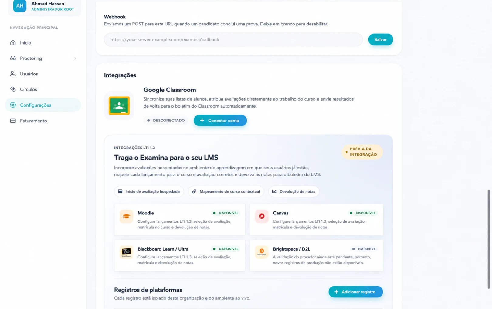

Mantenha o formulário aberto. O Blackboard precisa do Application ID antes de poder criar o Deployment ID específico da instituição que conclui este registro.

## 3. Registrar e aprovar o examina.io no Blackboard

Como um administrador do sistema Blackboard Learn:

1. Abra a área do administrador do Blackboard. Na navegação do Ultra, selecione **Admin do Sistema**; na Experiência Original, abra o **Painel do Administrador**.
2. Localize a seção **Integrações** e selecione **Provedores de Ferramentas LTI**.

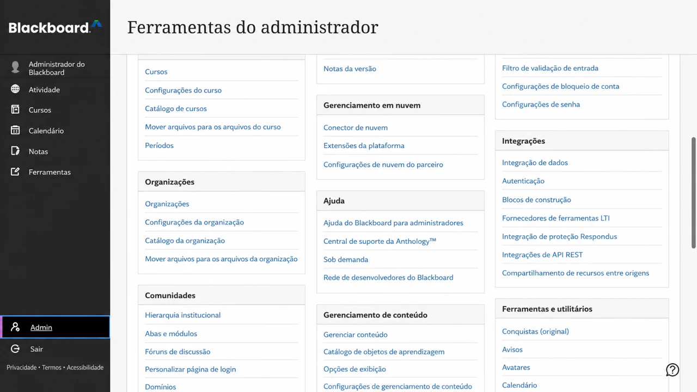

3. Selecione **Registrar Ferramenta LTI 1.3/Advantage**.

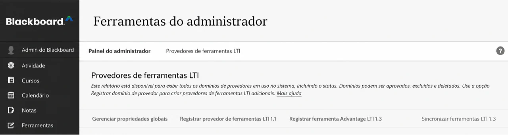

4. Insira o **Examina Application ID** e selecione **Enviar**.

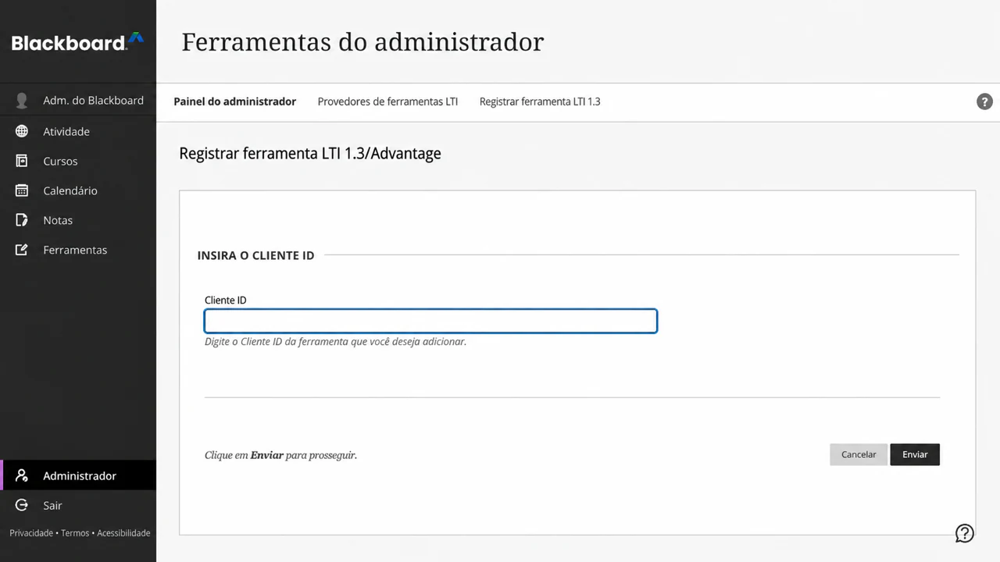

5. Revise o nome da ferramenta importada, domínio, URL da chave pública, URLs de redirecionamento e posicionamento gerenciado.
6. Defina o **Status da Ferramenta** como **Aprovado**.

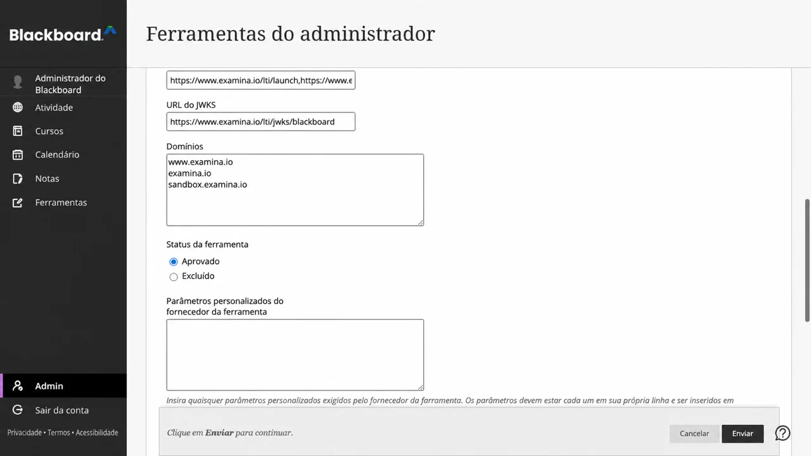

7. Em compartilhamento de dados do usuário, aprove os dados que sua instituição permite: **Nome**, **E-mail** e **Função**.
8. Ative **Permitir acesso ao serviço de notas** quando as pontuações devarem ser retornadas com AGS.
9. Ative **Permitir Acesso ao Serviço de Associação** apenas quando o acesso à lista de alunos do curso for necessário por meio do NRPS.
10. Selecione **Enviar**.

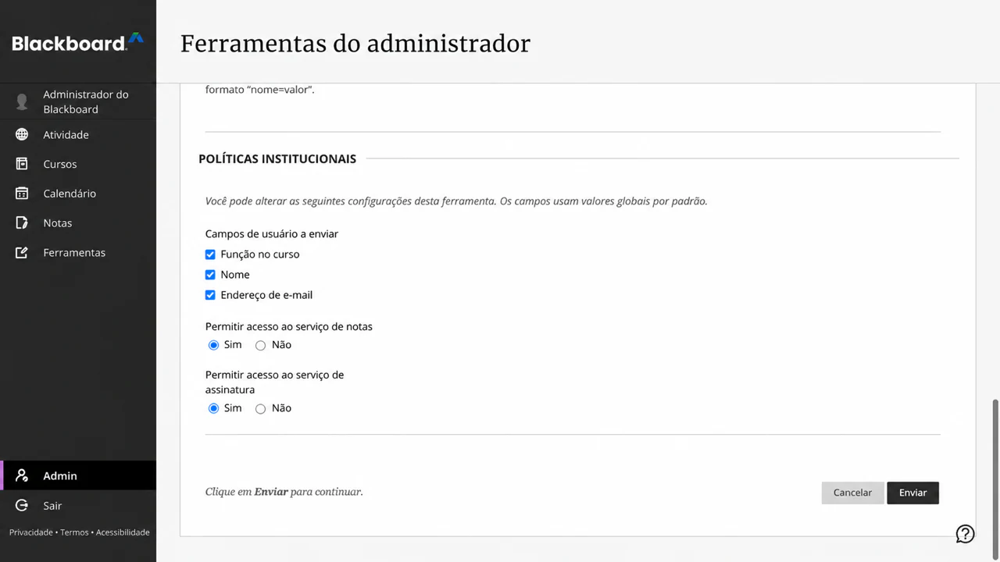

!!! note "Admin do Sistema é controlado por permissões"

    Se o **Admin do Sistema** não estiver visível na navegação principal do Blackboard, a conta conectada não possui a função de sistema necessária para instalar uma ferramenta LTI. Um instrutor não pode concluir esta etapa no nível da instituição.

O Blackboard sempre fornece um identificador de assunto LTI estável para o candidato. Nome e e-mail são dados de perfil, portanto, aprove-os apenas quando a política de sua instituição permitir que o examina.io os receba. A função é necessária para distinguir o fluxo de trabalho de um instrutor da inicialização feita por um candidato.

Abra o menu da ferramenta registrada e escolha **Gerenciar Implantações**. Copie o Deployment ID aplicável à instituição ou nó da hierarquia institucional onde os instrutores usarão o examina.io. Se a sua versão do Blackboard exibir apenas uma implantação, o mesmo valor poderá aparecer na página **Editar** da ferramenta. Este valor pertence a esta instalação do Blackboard e não deve ser copiado para outra instituição.

Crie outra implantação do Blackboard apenas quando a instituição precisar intencionalmente de um limite de instalação separado, como um campus diferente ou unidade licenciada. Cada Deployment ID precisa de seu próprio registro no examina.io.

Após o envio, a lista de provedores deve mostrar **examina.io Assessments** como uma ferramenta LTI 1.3 aprovada. Os campos de dados exatos e o número de posicionamentos dependem das permissões e posicionamentos aprovados por sua instituição.

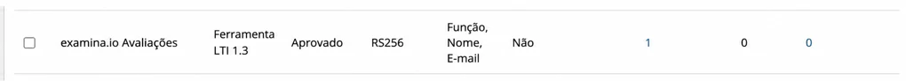

## 4. Concluir o registro no examina.io

Retorne a **Início → Configurações → Traga o Examina para o seu LMS**:

1. Continue no formulário aberto ou selecione **Adicionar registro → Blackboard Learn / Ultra** novamente.
2. Insira um nome descritivo, como **Blackboard da Faculdade Northbridge**.
3. Confirme o **Examina Application ID** somente leitura e cole o **Deployment ID** do Blackboard.
4. Confirme estes valores da plataforma Blackboard:

| Campo do examina.io | Valor do Blackboard |
| --- | --- |
| URL do emissor | `https://blackboard.com` |
| Examina Application ID | O Application ID fornecido centralmente e somente leitura |
| Deployment ID | O ID copiado desta instalação do Blackboard |
| Endpoint de autorização | `https://developer.blackboard.com/api/v1/gateway/oidcauth` |
| Endpoint de token | `https://developer.blackboard.com/api/v1/gateway/oauth2/jwttoken` |
| URL de chaves públicas (JWKS) do LMS | `https://developer.blackboard.com/.well-known/jwks.json` |

5. Ative a **Seleção de avaliação (Deep Linking)**.
6. Ative o **Retorno de notas (AGS)** se o acesso ao serviço de notas do Blackboard foi aprovado.
7. Ative a **Lista de alunos do curso (NRPS)** apenas se o Acesso ao Serviço de Associação do Blackboard foi aprovado.
8. Selecione **Salvar registro** e, em seguida, ative o registro.

O cartão de registro salvo é a fonte da verdade para as URLs exatas da ferramenta. Os valores de produção voltados para o navegador usam `https://www.examina.io`:

| Configuração da ferramenta Blackboard | Valor de produção do examina.io |
| --- | --- |
| Iniciação de login OIDC | Copie o valor completo do cartão de registro |
| URI de inicialização do LTI / link de destino | `https://www.examina.io/lti/launch` |
| Redirecionamento do Deep Linking | `https://www.examina.io/lti/deep-link` |
| Ícone da ferramenta | `https://www.examina.io/img/logo128.png` |
| Chaves públicas (JWKS) da ferramenta | Copie o valor específico do registro do cartão de registro |

Sempre copie os valores completos de OIDC e JWKS do cartão de registro porque eles identificam o registro salvo. A **URL de chaves públicas (JWKS) do LMS** do Blackboard na primeira tabela é o conjunto de chaves do Blackboard, que o examina.io lê. A URL das **chaves públicas (JWKS) da ferramenta** no cartão de registro é o conjunto de chaves do examina.io, que o Blackboard lê. Não as troque.

Application IDs e Deployment IDs são identificadores de configuração, não senhas. Nunca coloque chaves privadas, tokens de acesso, mensagens de inicialização assinadas ou dados de candidatos em documentações ou chamados de suporte.

## 5. Confirmar o posicionamento no Blackboard

Retorne a **Provedores de Ferramentas LTI** no Blackboard, abra o menu de **examina.io Assessments** e escolha **Gerenciar Posicionamentos**. Confirme se o posicionamento gerenciado aprovado:

- está disponível como uma ferramenta de conteúdo de Deep Linking;
- usa a URL de produção de Deep Linking do examina.io;
- possui o nome **examina.io Assessments**; e
- exibe o logotipo do examina.io.

Não crie um segundo posicionamento, a menos que sua instituição intencionalmente precise de um posicionamento separado com disponibilidade diferente. Um posicionamento duplicado pode deixar não claro qual registro o instrutor está iniciando.

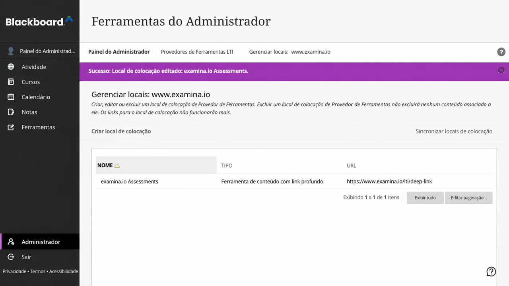

## 6. Adicionar um exame publicado a um curso Ultra

Como instrutor no curso de destino:

1. Abra **CHEM 101: General Chemistry → Conteúdo do Curso**.
2. Selecione o **+** onde a avaliação deve aparecer.
3. Escolha **Content Market**.
4. Localize **examina.io Assessments** em **Ferramentas da Instituição** e selecione-o.

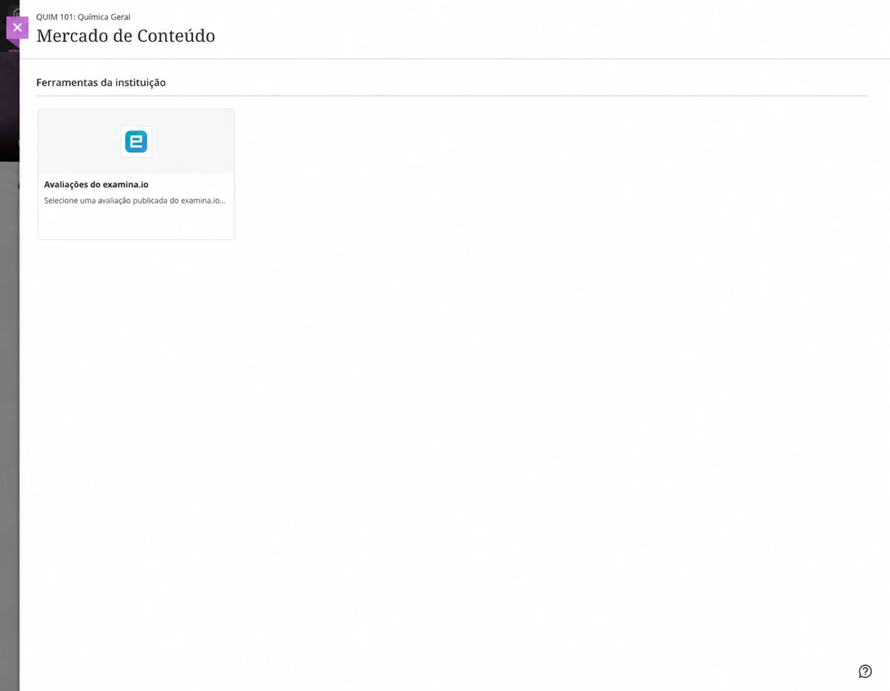

O seletor do examina.io se abre dentro do Blackboard. Selecione **General Chemistry Fundamentals** e, em seguida, escolha **Adicionar exame selecionado**.

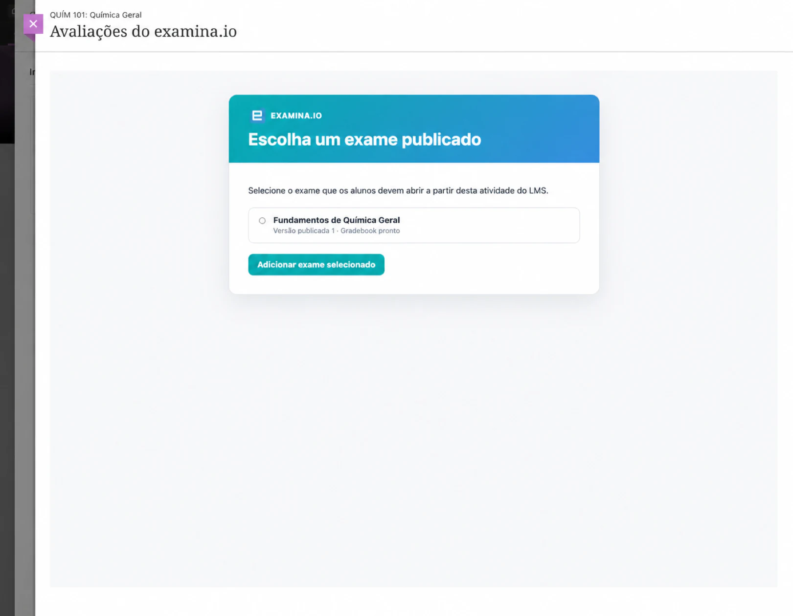

O Blackboard retorna ao curso e cria o item de conteúdo da avaliação. Confirme seu nome exibido ao candidato, visibilidade, data de entrega, pontuação máxima e política de tentativas e, em seguida, torne-o visível para os candidatos.

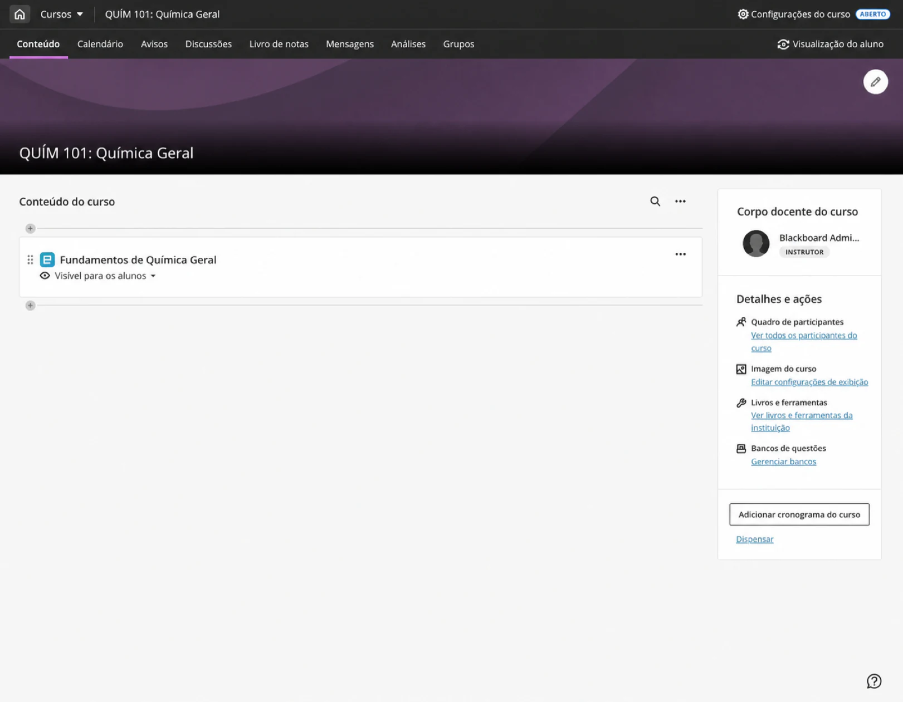

Abra o item uma vez como instrutor e confirme se o exame publicado pretendido aparece. Se o exame errado foi selecionado, remova o item de conteúdo e use o Content Market para selecioná-lo novamente.

## 7. Verificar a inicialização pelo candidato

Use um candidato fictício matriculado no curso:

1. Faça login no Blackboard como o candidato.
2. Abra **CHEM 101: General Chemistry → Conteúdo do Curso → General Chemistry Fundamentals**.
3. Confirme se a avaliação abre dentro do Blackboard sem um segundo login no examina.io.
4. Inicie, conclua e envie a avaliação.

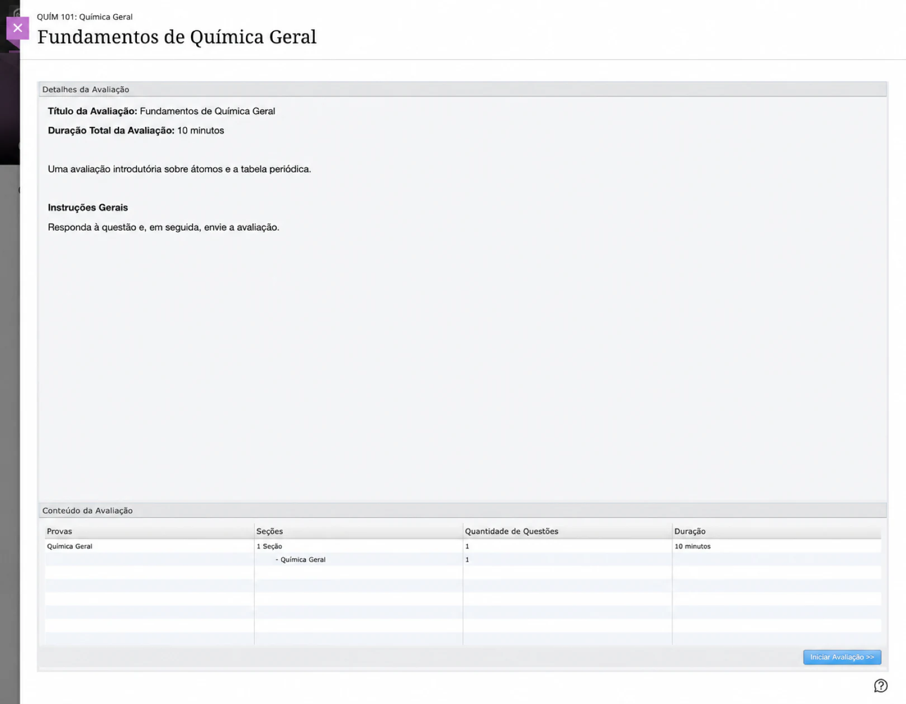

A inicialização via LTI verifica a plataforma Blackboard, Deployment ID, curso, item de conteúdo, candidato e a publicação selecionada. Uma URL de inicialização copiada não substitui a abertura da avaliação a partir do Blackboard.

## 8. Verificar a nota retornada

Após o envio, abra o **Centro de Qualificações** como instrutor. Confirme se a pontuação aparece para o **General Chemistry Fundamentals**, para o candidato correto e no item correto do centro de qualificações. O candidato também pode revisar o resultado na visualização de notas do curso.

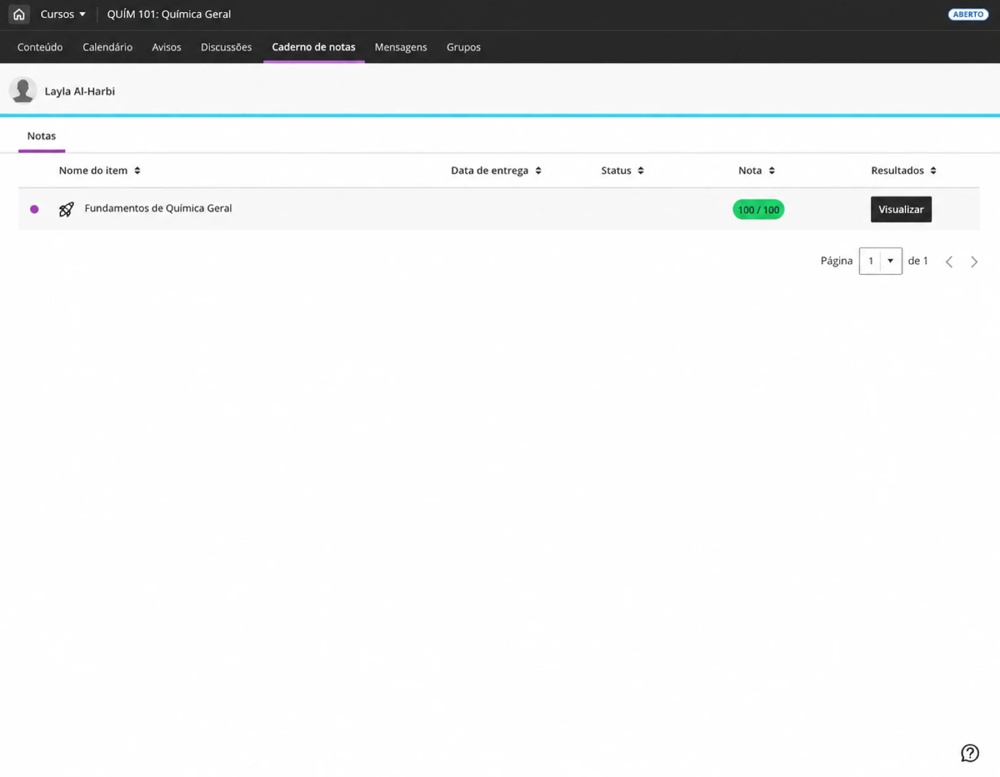

A entrega de notas é enfileirada separadamente do envio do exame, portanto, uma interrupção temporária do Blackboard não transforma uma avaliação concluída em um envio com falha. A pontuação pode levar um curto período para aparecer. Atualize o centro de qualificações antes de investigar um resultado ausente.

## Conectar outra instituição do Blackboard

O Examina Application ID fornecido centralmente pode ser instalado em mais de uma instituição do Blackboard. Para cada instituição:

1. registre o Application ID compartilhado no Blackboard Learn dessa instituição;
2. copie o Deployment ID exclusivo dessa instalação;
3. crie um registro separado do Blackboard na organização correta do examina.io; e
4. conceda apenas as permissões de dados do usuário, AGS e NRPS aprovadas para essa instituição.

Antes de uma implantação ampla, verifique se cada instituição visualiza apenas os exames publicados de sua organização e se as pontuações retornam apenas para o curso, candidato e item do centro de qualificações de origem.

## Lista de verificação para validação em produção

Antes de usar a integração para um curso ao vivo, verifique todos os itens a seguir:

- A ferramenta está **Aprovada** e disponível apenas onde pretendido.
- O **examina.io Assessments** aparece no Content Market com o logotipo do examina.io.
- O Application ID é o valor fornecido centralmente pelo examina.io.
- O Deployment ID veio desta instalação exata do Blackboard.
- O compartilhamento de Nome, E-mail e Função corresponde à política de dados aprovada da instituição.
- O AGS está ativado em ambos os sistemas quando as notas devem ser retornadas.
- O NRPS está ativado em ambos os sistemas apenas quando o acesso à lista de alunos do curso for necessário.
- O Deep Linking lista apenas exames publicados que o instrutor pode selecionar.
- O candidato abre a avaliação selecionada sem precisar de um segundo login.
- A pontuação concluída chega ao candidato e item do centro de qualificações corretos.
- Todo endereço voltado para o navegador usa HTTPS de produção e um certificado confiável.

## Solução de problemas

| Sintoma | O que verificar |
| --- | --- |
| **examina.io Assessments** está ausente do Content Market | Confirme se a ferramenta está aprovada, se seu posicionamento gerenciado do Deep Linking está disponível para este curso e se o usuário atual pode adicionar conteúdo ao curso. |
| O bloco do Content Market não exibe o logotipo do examina.io | Confirme se o posicionamento gerenciado usa `https://www.examina.io/img/logo128.png`. Se a ferramenta foi instalada antes de o ícone ser configurado, atualize os metadados da ferramenta existente ou atualize seu posicionamento. |
| O seletor abre, mas o Blackboard rejeita o exame selecionado | Confirme se o Application ID e o Deployment ID coincidem, se o Blackboard consegue obter a URL do JWKS do examina.io específica do registro exato e se ambos os sistemas possuem relógios precisos. |
| A avaliação abre em um quadro em branco ou a inicialização é recusada | Verifique a URL de iniciação OIDC, URL de inicialização, URLs de redirecionamento, certificado HTTPS confiável, status do registro, política de iframe e configurações de cookies de terceiros do navegador. |
| O Blackboard ainda abre um endereço antigo após a alteração da configuração do fornecedor | O Blackboard pode reter as URLs importadas quando a ferramenta ou posicionamento gerenciado foi criado. Inspecione a ferramenta existente e as URLs de destino do posicionamento. Atualize ou reative os metadados de registro existentes quando o Blackboard permitir. Se a ferramenta precisar ser registrada novamente, registre o novo Deployment ID e atualize o registro correspondente no examina.io antes de disponibilizar a substituição. Selecione novamente o conteúdo do curso afetado para que ele use o posicionamento atual. |
| O exame errado é aberto | Remova ou edite o conteúdo do curso e selecione o exame publicado pretendido novamente. Não copie um item de conteúdo entre instituições sem selecionar novamente o exame. |
| A nota não aparece | Confirme se **Permitir acesso ao serviço de notas** do Blackboard e **Retorno de notas (AGS)** do examina.io estão ativados, se o item de conteúdo possui pontos e se o registro está ativo. Aguarde um tempo para a entrega enfileirada. |
| A lista de alunos do curso está indisponível | Confirme se **Permitir Acesso ao Serviço de Associação** do Blackboard e **Lista de alunos do curso (NRPS)** do examina.io estão ativados. A inicialização de avaliações e o retorno de notas não exigem o NRPS. |
| O Blackboard informa um erro na chave de assinatura | Confirme se o Blackboard usa a URL de JWKS da ferramenta copiada do cartão de registro do examina.io e se o examina.io usa `https://developer.blackboard.com/.well-known/jwks.json` para as chaves do Blackboard. Nenhum dos dois endpoints deve redirecionar para uma página de login. |
| Uma segunda instituição visualiza o conteúdo da primeira instituição | Confirme se cada instituição possui seu próprio registro no examina.io e seu próprio Deployment ID do Blackboard. Nunca reutilize um Deployment ID entre instituições. |

Para obter informações sobre o comportamento atual e a terminologia da plataforma Blackboard, consulte a documentação oficial da Anthology sobre [registro de aplicativo LTI](https://docs.blackboard.com/docs/blackboard/lti/1.3/register-an-application) e [integração do administrador](https://help.anthology.com/blackboard/administrator/en/integrations.html).
