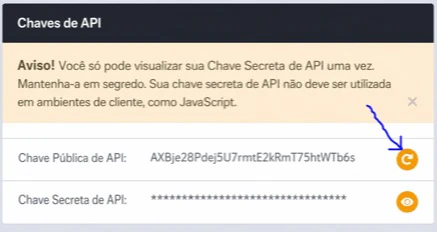
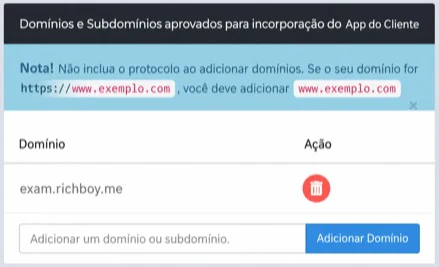
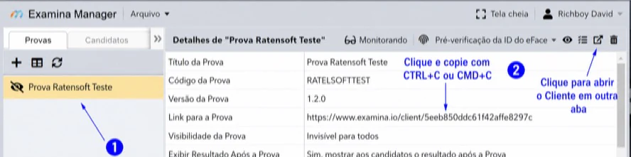

# Incorporar o aplicativo Client em seu site

O widget Client substitui um link de exame por um iframe para que os candidatos possam realizar uma avaliação dentro de um site aprovado.

Você precisa de:

- uma conta do examina.io e um plano compatível com incorporação;
- acesso a **Início → Configurações**;
- um exame importado no Manager;
- permissão para editar o site de hospedagem; e
- conhecimentos básicos de HTML.

## 1. Criar uma chave de API pública

Acesse **Início → Configurações → Chaves de API e Webhook** e crie uma **Chave Pública de API**.



A incorporação simples usa apenas a chave pública. Não coloque a Chave Secreta de API no código do navegador.

Regerar a chave pública exige que todas as instalações do widget sejam atualizadas.

## 2. Aprovar o domínio do site

Em **Domínios e Subdomínios Aprovados para incorporação do Widget Client**:

1. Insira o nome do host (hostname) sem protocolo ou caminho.
2. Selecione **Adicionar Domínio**.

Por exemplo, insira `assessment.example.edu`, não `https://assessment.example.edu/exams`.



Para testes locais, adicione o nome do host que você realmente usa, como `localhost` ou `127.0.0.1`; não inclua a porta. Remova os hosts de desenvolvimento após os testes. Evite permitir todos os domínios em produção.

## 3. Carregar o script do widget

Adicione o script do widget à página e substitua `YOUR_PUBLIC_API_KEY`:

```html
<!doctype html>
<html lang="en">
<head>
  <meta charset="utf-8">
  <meta name="viewport" content="width=device-width, initial-scale=1">
  <title>Fazer a avaliação</title>
  <script
    src="https://www.examina.io/client/widget.js?apiKey=YOUR_PUBLIC_API_KEY">
  </script>
</head>
<body>
  <h1>Avaliação de prontidão</h1>
</body>
</html>
```

Se a chave estiver ausente ou for inválida, o script do widget não será carregado corretamente.

## 4. Adicionar o link do exame

No Manager, selecione o exame e escolha **Abrir Link do Exame**. Copie a URL.



Adicione o link com a classe `examina-io-client-widget`:

```html
<a
  class="examina-io-client-widget"
  href="https://www.examina.io/client/YOUR_EXAM_ID">
  Abrir o exame
</a>
```

Quando o JavaScript está disponível, o widget substitui a âncora pelo Client incorporado. O texto da âncora continua sendo um fallback útil caso o script não possa ser executado. Insira apenas uma âncora de widget por página.

## Controlar as dimensões do widget

O widget usa estes atributos opcionais:

- `data-examina-io-height`
- `data-examina-io-width`

Se um atributo for omitido, o widget gerenciará essa dimensão em relação à janela do navegador e poderá ajustá-la quando a janela for redimensionada.

Use:

- um número positivo para uma dimensão fixa em pixels;
- um número negativo para usar o tamanho da janela menos esse número de pixels; ou
- `auto` para deixar essa dimensão para o seu CSS ou padrões do navegador.

Este exemplo reserva 64 pixels para um cabeçalho de página e deixa o CSS gerenciar a largura:

```html
<header class="exam-header">Avaliação de prontidão</header>
<a
  class="examina-io-client-widget"
  href="https://www.examina.io/client/YOUR_EXAM_ID"
  data-examina-io-height="-64"
  data-examina-io-width="auto">
  Abrir o exame
</a>
```

Teste na menor tela (viewport) suportada. Ao usar `auto`, aplique um tamanho explícito de CSS ao layout resultante para que o tamanho padrão de iframe do navegador não seja usado acidentalmente.

## Exemplo responsivo completo

```html
<!doctype html>
<html lang="en">
<head>
  <meta charset="utf-8">
  <meta name="viewport" content="width=device-width, initial-scale=1">
  <title>Avaliação de prontidão</title>
  <script
    src="https://www.examina.io/client/widget.js?apiKey=YOUR_PUBLIC_API_KEY">
  </script>
  <style>
    html, body { margin: 0; }
    .exam-header { box-sizing: border-box; height: 64px; padding: 20px; }
  </style>
</head>
<body>
  <header class="exam-header">Avaliação de prontidão</header>
  <a
    class="examina-io-client-widget"
    href="https://www.examina.io/client/YOUR_EXAM_ID"
    data-examina-io-height="-64"
    data-examina-io-width="auto">
    Abrir o exame
  </a>
</body>
</html>
```

## Login automático opcional

Se o seu próprio site já tiver autenticado o candidato, seu backend poderá solicitar um token de login de exame de curta duração e adicioná-lo ao link do Client. A Chave Secreta de API deve permanecer no seu servidor.

Fluxo do backend:

1. Autentique a pessoa em sua aplicação.
2. Resolva o código ou ID do candidato do examina.io no servidor.
3. A partir do seu servidor, chame um dos endpoints de token documentados com Autenticação Básica HTTPS:
   - `/login/exam/{examId}/code/{examineeCode}/token`
   - `/login/exam/{examId}/id/{examineeId}/token`
4. Construa a URL do Client com valores de consulta codificados em URL.
5. Renderize a chave pública e a URL de login com limite de tempo na página aprovada.

Formato de exemplo do link:

```html
<a
  class="examina-io-client-widget"
  href="https://www.examina.io/client/YOUR_EXAM_ID?autologin=true&amp;examineeCode=URL_ENCODED_CODE&amp;token=URL_ENCODED_TOKEN"
  data-examina-io-height="-64"
  data-examina-io-width="auto">
  Abrir o exame
</a>
```

`autologin` deve ser `true`. Forneça `examineeCode` ou `examineeId`; quando ambos estiverem presentes, o Client usará o código do candidato.

Nunca gere tokens no JavaScript do navegador, exponha a chave secreta ao candidato ou registre uma URL completa de login automático.

## Lista de verificação para produção

- O nome do host exato de produção está aprovado.
- A página e todos os recursos incorporados usam HTTPS.
- A Chave Secreta de API não está presente no código-fonte da página nem nas requisições de rede do navegador.
- O link de fallback é compreensível.
- Existe apenas um widget presente na página.
- Os comportamentos no computador, celular, teclado e redimensionamento foram testados.
- Um candidato fictício mapeado consegue entrar/fazer login ou realizar o login automático e concluir o exame.
- Os domínios temporários de desenvolvimento foram removidos.

Para configuração e rotação de credenciais, consulte [Chaves de API e webhooks](api-keys-and-webhooks.md). Para esquemas de endpoint, use a [Referência da API](../api/index.md).
