# Integrar o examina.io com o Moodle

Conecte o examina.io ao Moodle uma vez e, em seguida, permita que os professores adicionem avaliações publicadas aos seus cursos sem enviar os candidatos para uma página de login separada. Os candidatos abrem a avaliação dentro do Moodle, e o examina.io pode retornar suas pontuações para o livro de notas do Moodle.

!!! tip "Valide antes de uma avaliação ao vivo"

    Conecte e valide o fluxo de trabalho completo em um curso do Moodle de não produção com usuários fictícios antes de habilitá-lo para uma avaliação ao vivo.

As capturas de tela neste guia usam um curso fictício da **Northbridge College**, **Introduction to Biology**, e uma avaliação chamada **Cell Structure and Function**. Sua organização, URLs, IDs e nomes de cursos serão diferentes.

## O que a integração oferece

- **Um único login no Moodle:** um candidato que abre a atividade no Moodle não faz login no examina.io novamente.
- **Seleção de avaliações:** o professor escolhe uma prova publicada por meio do LTI Deep Linking em vez de copiar uma URL de prova.
- **Posicionamento contextualizado no curso:** o examina.io associa o curso e a atividade do LMS à avaliação publicada selecionada.
- **Retorno de notas:** os Serviços de Tarefa e Nota do LTI (AGS) podem retornar o resultado do candidato para o item de nota correto do Moodle.
- **Lista do curso opcional:** os Serviços de Provisionamento de Nomes e Funções (NRPS) podem fornecer uma lista mínima do curso quando sua instituição os habilitar.

## Antes de começar

Você precisa de:

- uma conta de Root ou Administrador no examina.io;
- uma conta de administrador do site Moodle;
- uma conta de professor para o curso do Moodle;
- pelo menos uma prova que tenha sido importada e publicada no examina.io Manager;
- endereços HTTPS públicos para o Moodle e o examina.io; e
- permissão para configurar uma ferramenta externa LTI 1.3 e seus serviços no Moodle.

Garanta que ambos os sistemas tenham relógios precisos. As mensagens de login do LTI têm limite de tempo, e uma grande diferença de horário pode fazer com que uma inicialização válida falhe.

## Como os dois sistemas trocam configurações

O Moodle cria o **Client ID** e o **Deployment ID** que o examina.io precisa. O examina.io, então, cria a URL de chave pública específica do registro de que o Moodle precisa. Por esse motivo, a configuração inicial tem duas etapas:

1. criar uma ferramenta externa provisória no Moodle;
2. copiar os detalhes de registro do Moodle para o examina.io;
3. copiar os endpoints finais do examina.io de volta para o Moodle; e
4. ativar o registro e testar o fluxo completo.

!!! warning "Não inicie uma ferramenta provisória"

    Se o Moodle exigir uma URL de chave pública durante a primeira etapa, use um endpoint temporário de conjunto de chaves HTTPS controlado por sua instituição. Ele pode retornar um JSON Web Key Set vazio (`{"keys":[]}`). Não disponibilize a ferramenta para os cursos nem tente uma inicialização até substituí-la pela URL exata do **Public key set (JWKS)** do examina.io na [Etapa 4](#4-finish-the-moodle-tool).

## 1. Criar a ferramenta provisória no Moodle

Faça login com uma conta de administrador do site Moodle e abra **Administração do site** na navegação principal.

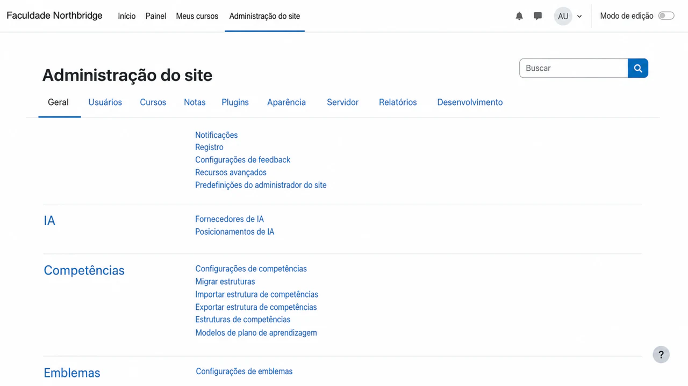

Selecione a aba **Plugins**. Em **Módulos de atividade**, selecione **Ferramenta externa**.

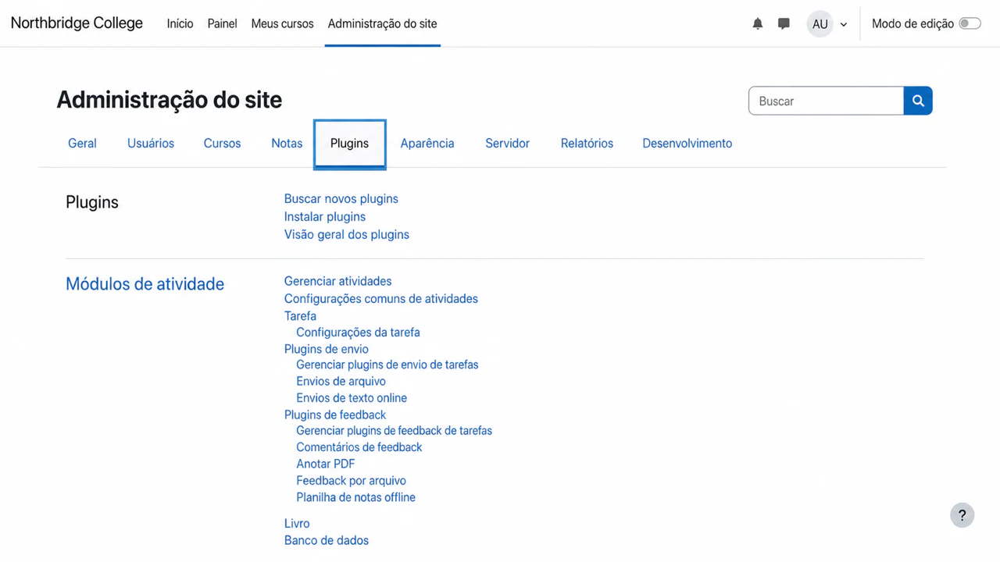

Na página de configurações de Ferramenta externa, selecione **Gerenciar ferramentas**.

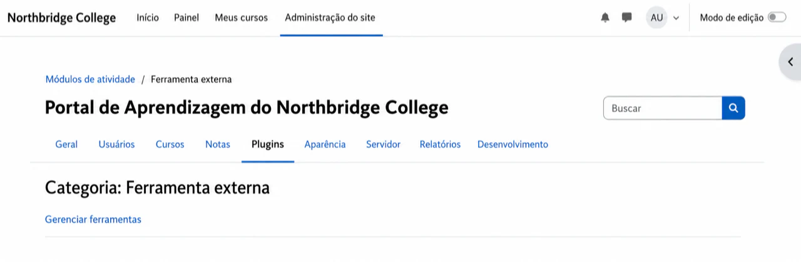

Selecione **Configurar uma ferramenta manualmente**. Se outra ferramenta do examina.io já existir, edite-a em vez de criar uma duplicata.

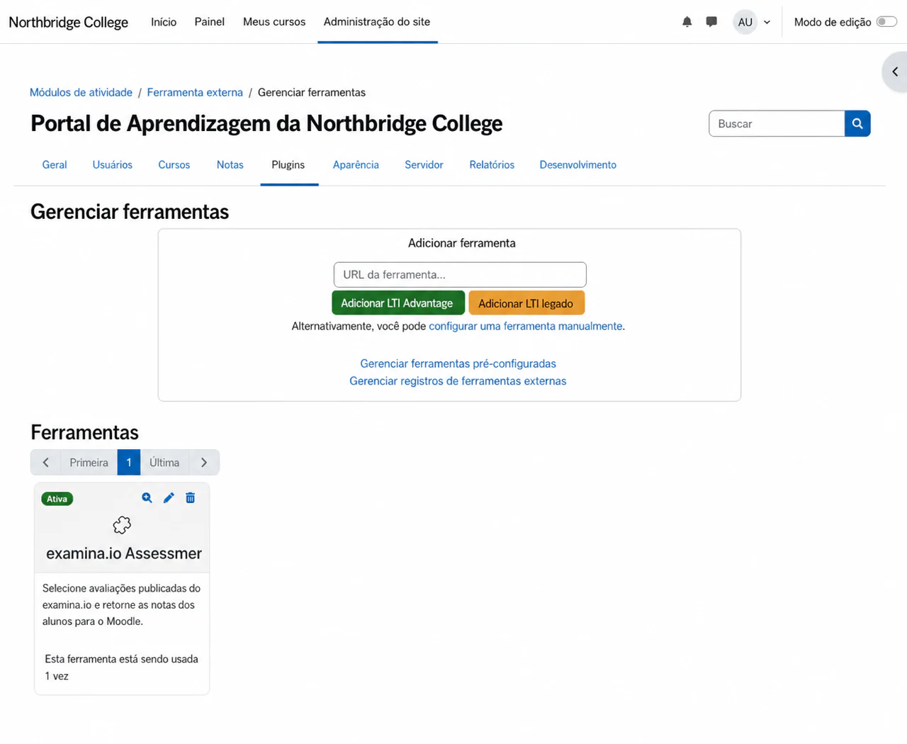

Preencha o formulário da ferramenta:

1. Insira **examina.io Assessments** como o nome da ferramenta.
2. Insira `https://www.examina.io/lti/launch` como a **URL da ferramenta**.
3. Defina **Versão do LTI** como **LTI 1.3**.
4. Defina **Tipo de chave pública** como **URL do Keyset**.
5. Insira a URL provisória do conjunto de chaves descrita acima.
6. Insira `https://www.examina.io/lti/login` como a **URL de início de login**.
7. Adicione as URLs de inicialização e de Deep Linking como **URI(s) de redirecionamento** separadas:
   `https://www.examina.io/lti/launch` e
   `https://www.examina.io/lti/deep-link`.
8. Habilite **Suporta Deep Linking** e insira
   `https://www.examina.io/lti/deep-link` como a **URL de seleção de conteúdo**.
9. Mantenha a ferramenta oculta do seletor de atividades até que a configuração esteja concluída e, em seguida, salve-a.

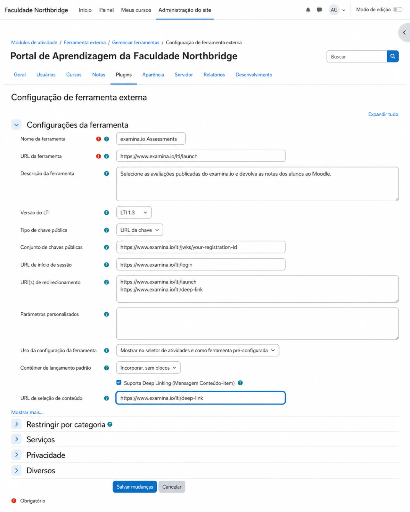

!!! warning "O valor do JWKS na captura de tela é um exemplo"

    `your-registration-id` é um marcador de posição, não um valor a ser copiado. Depois de salvar os detalhes do Moodle no examina.io, substitua toda essa URL pela URL exata do **Public key set (JWKS)** exibida no cartão de registro salvo.

O Moodle agora atribui a identidade da ferramenta necessária para o examina.io.

## 2. Copiar os detalhes de registro do Moodle

Retorne a **Gerenciar ferramentas**, encontre **examina.io assessments** e selecione **Exibir detalhes da configuração**. Mantenha esta página aberta enquanto configura o examina.io.

Copie estes valores do Moodle nos campos correspondentes do examina.io:

| Detalhes da configuração do Moodle | Campo de registro do examina.io |
| --- | --- |
| Platform ID | Issuer URL |
| Client ID | Client ID |
| Deployment ID | Deployment ID |
| Authentication request URL | Authorization endpoint |
| Access token service URL | Token endpoint |
| Public keyset URL | LMS public keys (JWKS) URL |

Trate os identificadores como dados de configuração. Não coloque tokens de acesso, chaves privadas, mensagens de inicialização do usuário ou senhas em documentações ou chamados de suporte.

## 3. Adicionar o registro do Moodle no examina.io

Como Root ou Administrador no examina.io:

1. Abra **Início → Configurações**.
2. Encontre **Traga o Examina para o seu LMS**.
3. Selecione **Adicionar registro**.
4. Escolha **Moodle** e insira um nome descritivo, como **Northbridge College Moodle**.
5. Cole os seis valores do Moodle da Etapa 2.
6. Habilite apenas os serviços que você também concederá no Moodle:
   - **Seleção de avaliações (Deep Linking)** permite que os professores escolham uma prova publicada a partir do formulário de atividades do Moodle.
   - **Retorno de notas (AGS)** envia os resultados concluídos para o livro de notas do Moodle.
   - **Lista do curso (NRPS)** lê os membros do curso quando seu fluxo de trabalho precisa.
7. Selecione **Salvar registro**.

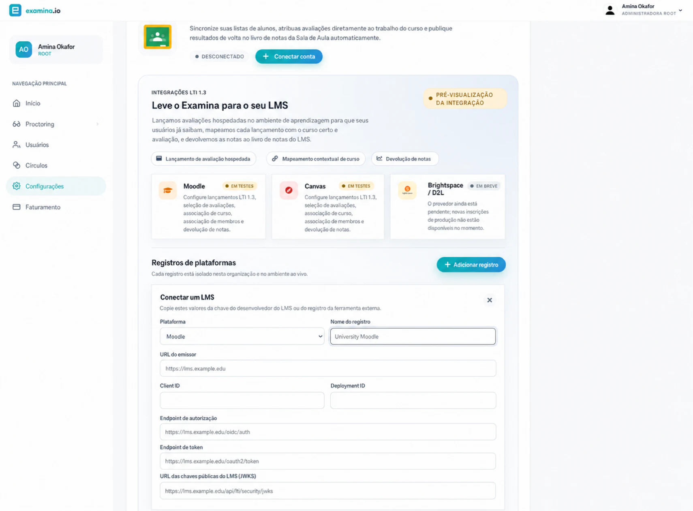

O cartão de registro salvo exibe os endpoints exatos de **OIDC login initiation**, **LTI launch**, **Deep Linking** e o **Public key set (JWKS)** específico do registro. Mantenha o cartão aberto para a próxima etapa.

## 4. Finalizar a ferramenta no Moodle {#4-finish-the-moodle-tool}

Edite **examina.io assessments** no Moodle e substitua cada valor provisório pelo valor exato exibido pelo examina.io:

| Campo de ferramenta externa do Moodle | Valor do examina.io |
| --- | --- |
| URL da ferramenta | LTI launch URL |
| URL de início de login | OIDC login initiation |
| URI(s) de redirecionamento | LTI launch URL e Deep Linking URL, uma por linha |
| Keyset público | Public key set (JWKS) |
| URL de seleção de conteúdo, quando exibida | Deep Linking URL |

Em seguida, configure os serviços e as configurações de privacidade do Moodle:

- Habilite **Serviços de Tarefa e Nota do IMS LTI** se você habilitou o **Retorno de notas (AGS)** no examina.io.
- Permita que a ferramenta aceite notas das configurações de serviço delegadas do Moodle.
- Habilite os **Serviços de Provisionamento de Nomes e Funções** apenas se você habilitou a **Lista do curso (NRPS)** e sua instituição permitir o acesso à lista.
- Disponibilize a ferramenta no seletor de atividades depois que as configurações de endpoint e serviço estiverem concluídas.
- Use **Incorporar** como o contêiner de inicialização padrão se quiser que a avaliação permaneça dentro da página do curso no Moodle.

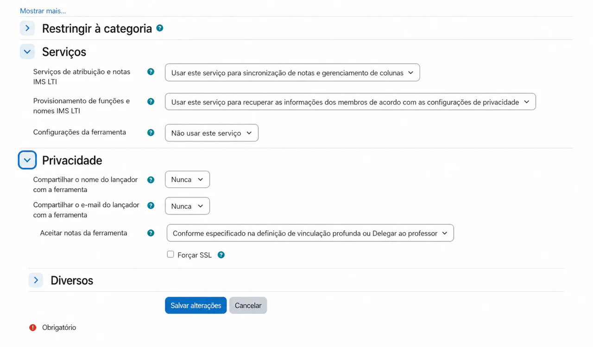

O compartilhamento do nome de exibição ou endereço de e-mail do Moodle é opcional. O examina.io pode mapear um candidato do LTI usando o identificador pseudônimo do assunto da plataforma. Habilite campos de perfil adicionais apenas quando sua instituição tiver uma necessidade documentada e base legal para compartilhá-los.

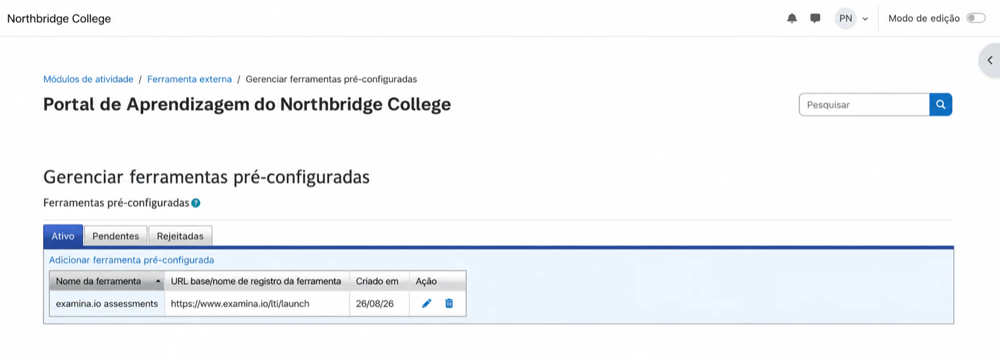

Retorne ao examina.io e ative o registro. Um registro suspenso ou revogado não pode aceitar novas inicializações.

## 5. Adicionar uma avaliação publicada a um curso do Moodle

Como professor no curso de destino:

1. Ative o **Modo de edição**.
2. Selecione **Adicionar uma atividade ou recurso** na seção do curso desejada.
3. Escolha **Ferramenta externa** ou a ferramenta pré-configurada **examina.io assessments**.
4. Insira o nome da atividade visível ao candidato.
5. Selecione **Selecionar conteúdo**.

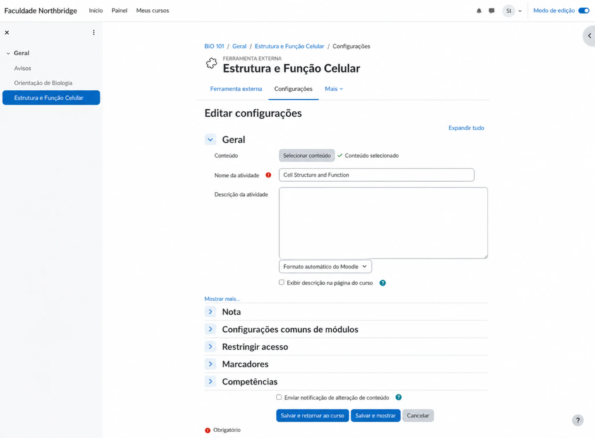

O examina.io abre uma lista de avaliações publicadas que o instrutor pode usar. Escolha a avaliação pretendida e confirme a seleção. Neste exemplo, o professor escolhe **Cell Structure and Function** para **Introduction to Biology**.

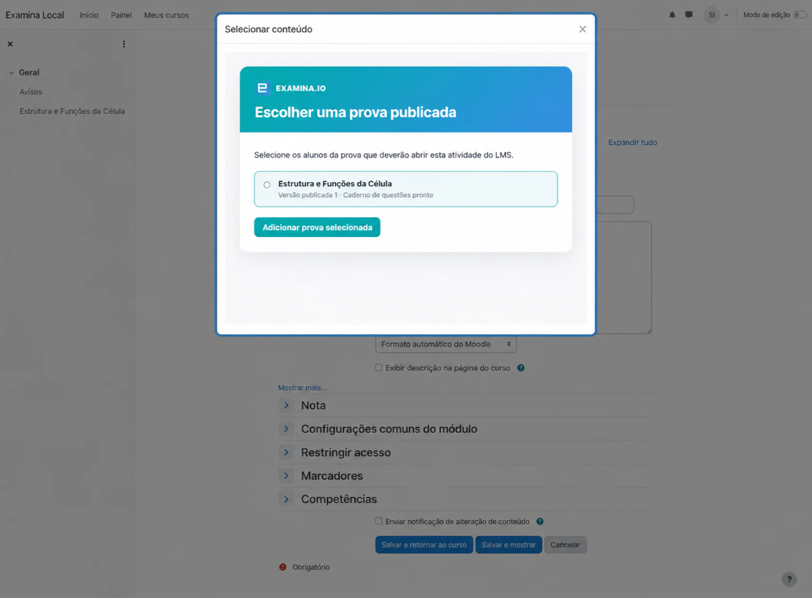

Salve a atividade e abra-a uma vez como professor. Confirme que a atividade exibe o título correto da avaliação e não solicita nome de usuário e senha separados do examina.io.

## 6. Verificar a experiência do candidato

Use um candidato fictício inscrito no curso para validação:

1. Faça login no Moodle como o candidato.
2. Abra o curso e selecione a atividade de avaliação.
3. Confirme que a prova esperada é aberta dentro do Moodle.
4. Conclua e envie a avaliação.

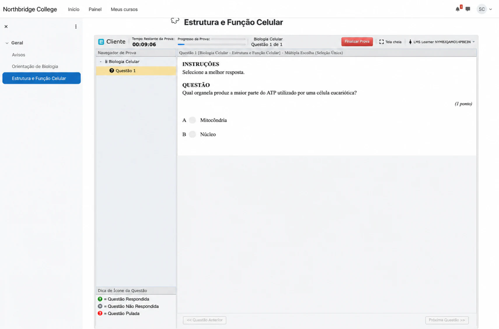

A identidade do candidato no Moodle, o curso, a localização da atividade e a avaliação publicada selecionada são verificados durante a inicialização do LTI. Uma URL copiada de um curso ou ambiente diferente não substitui essa inicialização.

## 7. Verificar a nota retornada

Após o candidato enviar, abra **Notas → Relatório de notas** no Moodle. Confirme que o resultado aparece na atividade e candidato corretos.

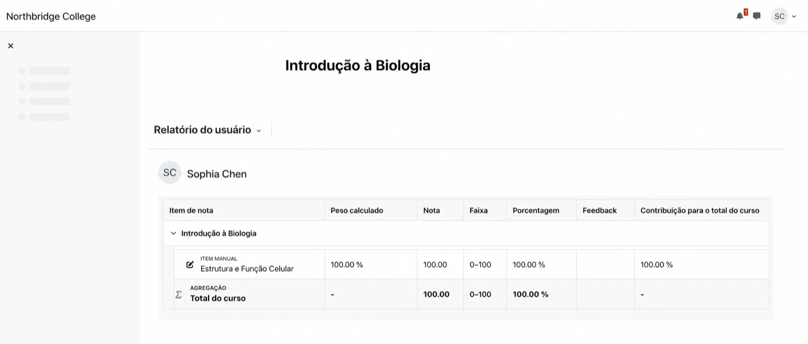

A entrega das notas é enfileirada separadamente do envio da prova para que uma queda temporária do Moodle não transforme uma avaliação concluída em um envio com falha. Portanto, o resultado pode levar um curto período para aparecer. Atualize o livro de notas antes de investigar um resultado ausente.

## Lista de verificação de validação para produção

Antes de habilitar a ferramenta para um curso ao vivo, verifique todos os itens a seguir com um curso de não produção e usuários fictícios:

- A ferramenta do Moodle está ativa e usa os endpoints finais do examina.io.
- O registro do examina.io está ativo na organização e no ambiente corretos.
- O Deep Linking lista apenas as avaliações que o professor tem permissão para selecionar.
- A atividade selecionada inicia a avaliação publicada pretendida.
- O candidato inicia a avaliação a partir do Moodle sem um segundo login.
- A pontuação concluída chega ao candidato e ao item de nota corretos.
- Reabrir ou atualizar a atividade não cria itens de nota duplicados.
- O NRPS está desativado quando o acesso à lista do curso não é necessário.
- Ambos os aplicativos usam URLs HTTPS públicas e certificados confiáveis.

## Solução de problemas

| Sintoma | O que verificar |
| --- | --- |
| **Selecionar conteúdo** está ausente | Confirme se a ferramenta está ativa, se o Deep Linking está habilitado em ambos os sistemas, se a URL de Deep Linking está presente e se o usuário atual do Moodle pode adicionar atividades. |
| A atividade abre uma página em branco ou a inicialização é recusada | Verifique o emissor (issuer), Client ID, Deployment ID, URL de login OIDC, URL de inicialização, certificado HTTPS, política de iframe e restrições de cookies de terceiros do navegador. Garanta que nenhum Docker interno ou nome de host privado apareça em uma URL voltada para o navegador. |
| A avaliação errada é aberta | Edite a atividade do Moodle e selecione a avaliação publicada novamente. Não copie uma atividade entre ambientes sem selecionar novamente seu conteúdo. |
| A nota não aparece | Confirme se o AGS e a aceitação de notas estão habilitados no Moodle, se o **Retorno de notas** está habilitado no examina.io e se a atividade tem um item de nota. Aguarde um curto período para a entrega enfileirada. |
| A lista do curso não está disponível | Confirme se o NRPS está habilitado e concedido no Moodle. A inicialização da avaliação e o retorno de notas podem continuar sem acesso à lista do curso. |
| O Moodle relata um erro de chave ou assinatura | Confirme se o Moodle usa a URL do JWKS do examina.io específica do registro, se o examina.io usa a URL de chave pública atual do Moodle, se ambos os relógios estão precisos e se nenhum dos endpoints redireciona para uma página de login. |

Para a terminologia do Moodle e menus atuais, consulte a documentação oficial sobre [Ferramentas externas](https://docs.moodle.org/502/en/LTI_External_tools) e [Perguntas frequentes sobre ferramentas externas](https://docs.moodle.org/502/en/LTI_External_tool_FAQ).
