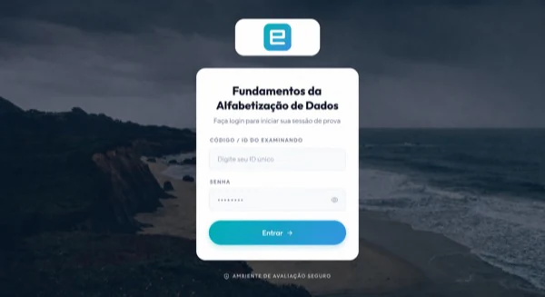
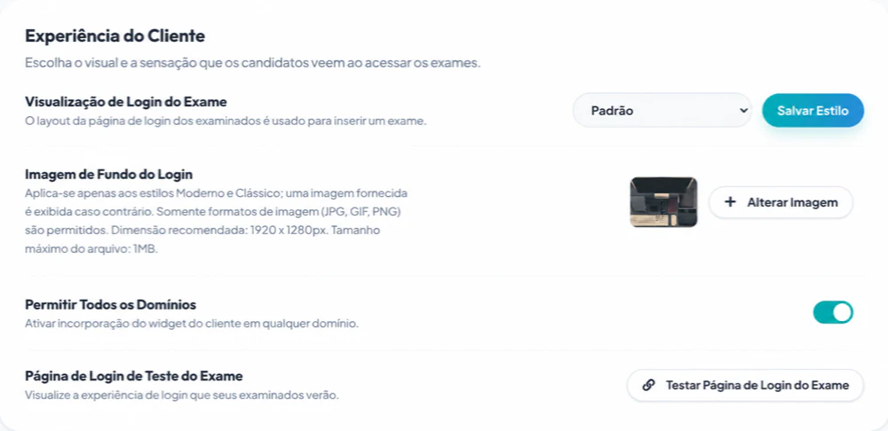

# Personalizar a página de login do exame

Contas Root e Administrator podem configurar um estilo de login, logotipo e imagem de fundo para toda a organização em **Início → Configurações**. A disponibilidade pode depender do plano da organização.

## Escolher um estilo

O Client oferece três estilos:

1. **Default**
2. **Modern**
3. **Classic**

O Default suporta a identidade visual específica do exame criada no Designer. O Modern e o Classic usam o logotipo e a imagem de fundo da organização.

O Classic aplica um tratamento visual sobre o fundo para preservar o contraste ao redor dos campos de login. Verifique a imagem final em ambos os estilos em vez de presumir que parecerão idênticos.

## Enviar o logotipo da organização

1. Faça login como Root ou Administrator.
2. Abra **Início → Configurações**.
3. Em **Personalização do Logotipo**, selecione **Enviar Novo Logotipo**.
4. Escolha um arquivo JPG, GIF ou PNG de no máximo 512 KB.
5. Aguarde a conclusão do envio.

Se nenhum logotipo for configurado, o nome da organização poderá aparecer em seu lugar. Use um logotipo com espaçamento claro e contraste suficiente tanto para fundos claros quanto fotográficos.

## Selecionar um estilo de login

1. Localize **Experiência do Client**.
2. Em **Visualização de Login do Exame**, escolha Default, Modern ou Classic.
3. Selecione **Salvar Estilo**.

A alteração é aplicada em nível de organização. Coordene-a com qualquer pessoa que esteja executando um exame ativo antes de alternar os estilos.

## Enviar um plano de fundo

1. Em **Imagem de Fundo do Login**, selecione **Alterar Imagem**.
2. Escolha um arquivo JPG, GIF ou PNG.
3. Use as dimensões recomendadas exibidas — 1920 × 1280 pixels — e permaneça dentro do limite de tamanho de arquivo exibido.
4. Aguarde a conclusão do envio.

O Modern e o Classic podem usar um plano de fundo fornecido quando nenhuma imagem personalizada for configurada. Selecione a pequena pré-visualização para inspecionar o plano de fundo atual em um tamanho maior.

## Testar o resultado

Se pelo menos um exame estiver disponível, selecione **Testar Página de Login do Exame**. Verifique:

- tamanho e nitidez do logotipo;
- contraste do texto;
- o formulário de login em larguras de computador e celular;
- foco do teclado e legibilidade dos campos; e
- tempo de carregamento em uma conexão mais lenta; e
- se a identidade correta da organização está inconfundível.

Abra o teste em uma janela anônima do navegador para ver a experiência do candidato sem depender da sessão de administrador.

## Orientações para imagens

- Evite texto incorporado no plano de fundo; ele pode ser cortado ou ocultado.
- Mantenha o foco visual distante do formulário de login.
- Comprima fotos grandes antes do envio.
- Use imagens que sua organização tenha permissão para publicar.
- Não inclua nomes de candidatos, questões de exames ou outros dados confidenciais em ativos de marca.

Para obter o restante das configurações da organização, consulte [Configurações e marca da organização](../administration/organization-settings.md).
