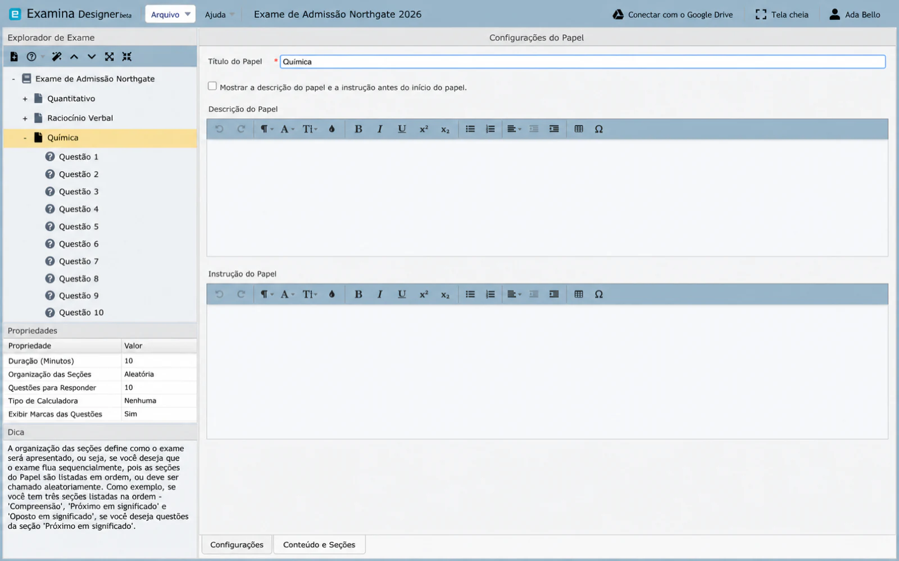

# Criar e configurar uma prova

Uma prova é uma unidade com tempo determinado dentro de um exame. Ela pode representar uma matéria, curso, módulo ou outro segmento de avaliação. Um exame pode conter várias provas.

## Criar uma prova

1. Crie ou abra um projeto de exame.
2. Clique com o botão direito no exame no **Exam Explorer**.
3. Selecione **Nova prova de exame**.
4. Selecione a nova prova, como **Prova 1**.
5. Preencha suas propriedades.

Os títulos das provas devem ser exclusivos dentro do exame.

## Propriedades da prova

**Título da prova**

: O nome exibido ao candidato, como Matemática, Aptidão ou Biologia 201.

**Descrição e instruções**

: Opcional, a menos que **Mostrar descrição e instruções antes do início da prova** esteja ativado. Explique as regras de tempo, escolha, calculadora ou navegação específicas da prova.

**Duração da prova**

: O tempo permitido em minutos. A duração mínima é de cinco minutos.

**Organização das seções**

: Controla se as seções são apresentadas sequencialmente ou selecionadas em uma ordem aleatória.

**Questões a responder**

: Define quantas questões o Client apresenta a partir do banco disponível. Use isso para extrair um subconjunto aleatório de um banco de questões maior.

Defina o valor de questões a responder depois de concluir a autoria. Adicionar questões posteriormente pode redefini-lo para a contagem total de questões da prova, portanto, verifique novamente antes de exportar.

**Tipo de calculadora**

: Permite sem calculadora ou uma das calculadoras suportadas: Simples, Avançada ou Base.

**Mostrar pontuação das questões**

: Controla se o valor da pontuação atribuído a cada questão fica visível para o candidato.

## Seções e conteúdo

Abra **Conteúdos e seções** para criar seções e definir:

- a ordem das seções;
- questões sequenciais ou aleatórias dentro de uma seção; e
- quantas questões são selecionadas de cada seção.

Por exemplo, uma prova de idiomas pode conter seções de Oral, Compreensão e Vocabulário em uma ordem fixa, enquanto aleatoriza as questões dentro de cada seção.

## Reutilizar questões

Para duplicar conteúdo existente no projeto aberto, copie uma questão e cole-a na prova de destino. Consulte [Reutilizar conteúdo do projeto](importing-questions.md) para obter o fluxo de trabalho suportado. Para trazer questões de um documento ou de outro projeto, clique com o botão direito na prova e consulte [Importar conteúdo existente](import-content.md).

## Validar a prova

- O título é exclusivo e reconhecível.
- A duração e as instruções estão de acordo.
- A ordem das seções e a aleatorização são intencionais.
- A contagem de questões a responder não excede o banco disponível.
- As configurações de calculadora e exibição de pontuação são apropriadas.
- Todas as questões foram visualizadas.

Continue em [Criar questões](questions.md).
