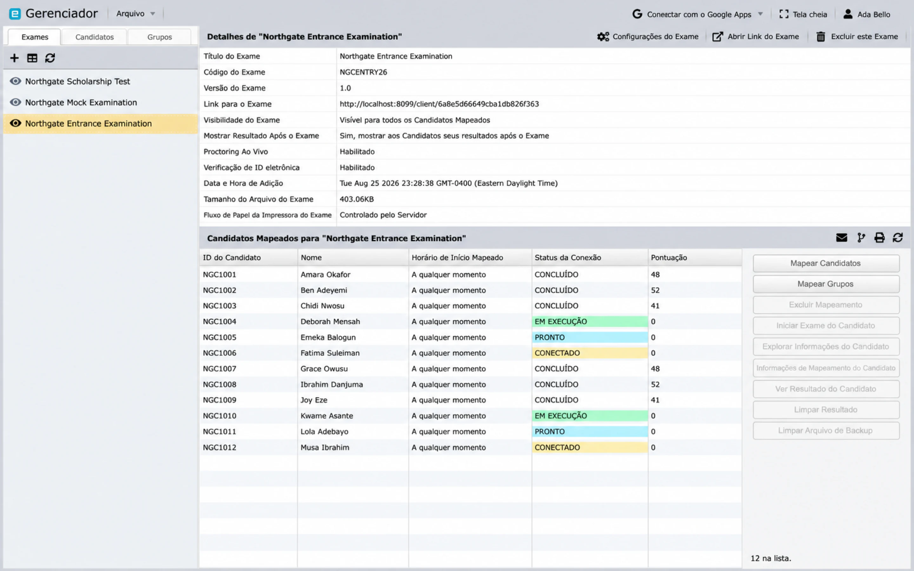

# Entregar, monitorar e gerar relatórios

Use este guia após a prova, os candidatos e os mapeamentos de cadernos terem sido preparados. As ações exatas disponíveis dependem do tipo de prova, plano, função e estado atual da prova.

## Lista de verificação pré-entrega

Selecione a prova no Manager e verifique:

- **Visibilidade:** mantenha a prova invisível até que esteja pronta para os candidatos.
- **Candidatos mapeados:** a lista e as atribuições de cadernos estão completas.
- **Horário:** os horários de início mapeados e os fusos horários estão corretos.
- **Exibição de resultados:** decida se os candidatos verão os resultados após a conclusão ou uma mensagem genérica de conclusão.
- **Fiscalização de provas ao vivo:** ative apenas quando necessário e com equipe alocada.
- **Verificação de identidade:** verifique fotos, consentimento, isenções e contatos de emergência quando o recurso for utilizado.
- **Dispositivos:** decida se celulares ou tablets são permitidos e qual layout do Client eles devem receber.
- **Política de desconexão:** escolha o que deve acontecer após repetidas falhas de salvamento ou uma perda prolongada de conexão.
- **Instruções:** confirme se as instruções da prova e do caderno correspondem às regras operacionais finais.

O Client salva o estado da prova periodicamente enquanto está conectado. Uma desconexão impede que o novo estado chegue ao servidor, portanto, a política configurada e as instruções ao candidato devem levar em consideração a perda de rede.

## Testar antes de publicar

Use um candidato de teste designado e abra **Abrir link da prova** em uma janela anônima do navegador. Teste o mesmo caminho que os candidatos reais usarão:

1. faça login com as credenciais do candidato;
2. conclua quaisquer verificações de identidade ou dispositivo;
3. verifique os cadernos disponíveis;
4. inicie e responda a um pequeno caderno de teste;
5. reconecte após uma breve interrupção de rede, se viável;
6. finalize e confirme a tela de conclusão ou resultado; e
7. verifique o resultado no Manager.

Não reutilize as credenciais de um candidato real para testes.

## Publicar e enviar a prova

1. Alterne a prova para **Visível**.
2. Selecione **Abrir link da prova** e copie o link final.
3. Use **Enviar e-mail aos candidatos** quando os candidatos mapeados tiverem endereços de e-mail válidos, ou distribua o link por meio do seu sistema de comunicação aprovado. Consulte [Enviar e-mail aos candidatos](email-examinees.md) para obter os marcadores de personalização e links de login que evitam que os candidatos precisem digitar um código e uma senha.

Informe aos candidatos a data, o horário, o fuso horário, o link, o método de distribuição de credenciais, os requisitos de dispositivo, as expectativas de fiscalização de provas e o contato de suporte. Compartilhe o [guia do dia do teste](../client/take-an-exam.md).

## Monitorar uma sessão ativa

A tabela de candidatos mapeados da prova é a visualização de monitoramento. Ela mostra o estado de conexão de cada pessoa e, assim que elas terminam, a sua pontuação.

O Manager mostra os estados de mapeamento e conexão como **Conectado**, **Pronto**, **Em execução**, **Desconectado** e **Finalizado**, com códigos de cores para que a aplicação em andamento possa ser visualizada rapidamente. Atualize a tabela de mapeamento antes de tomar uma decisão para ter os dados mais recentes do servidor.

Dependendo da configuração da prova, as ações podem incluir:

- iniciar ou interromper a prova de um candidato;
- iniciar ou interromper a prova;
- monitorar um candidato ou a prova completa;
- inspecionar informações de mapeamento; e
- desconectar um candidato da prova.

Se a fiscalização de provas ao vivo estiver ativada, abra a prova em **Fiscalização** na barra lateral da conta. Os fiscais podem precisar aprovar um candidato antes do início da prova.

## Tratar incidentes comuns

**O candidato não consegue ver a prova**

: Confirme a visibilidade, o mapeamento, os cadernos selecionados, o horário de início, o fuso horário e o acesso ao Circle para o membro da equipe que está investigando.

**O candidato não consegue fazer login**

: Verifique o link exato da prova, código, senha, mapeamento da prova e o uso de maiúsculas e minúsculas. Redefina ou redistribua credenciais apenas por meio de um canal aprovado.

**A conexão mostra Desconectado**

: Peça ao candidato para manter a página da prova aberta, restaurar a rede e seguir as [orientações de reconexão](../client/troubleshooting.md). Atualize o Manager antes de enviar comandos para iniciar, interromper ou desconectar.

**O Proctor não consegue ver a prova**

: Confirme se a fiscalização de provas ao vivo está ativada, se a função do fiscal está correta e se o fiscal tem acesso por meio do Circle relevante.

## Analisar resultados

Depois que um candidato terminar, use **Ver resultado do candidato** para um indivíduo ou **Ver resultado da prova** para a avaliação. Os resultados podem incluir:

- questões respondidas e não respondidas;
- questões ignoradas;
- pontuação possível e atingida; e
- pontuação em porcentagem.

Use **Gerar relatório** para obter um relatório de prova mais abrangente. Os candidatos que não finalizaram podem ser excluídos, portanto, confirme a contagem de finalizados antes de considerar um relatório como definitivo.

## Correções e novas tentativas

**Limpar resultado** exclui o resultado existente do candidato selecionado para essa prova e pode permitir uma nova tentativa. Esta ação não é reversível. Antes de usá-la:

1. confirme o candidato e a prova corretos;
2. preserve qualquer registro de auditoria ou resultado necessário;
3. registre a autorização e o motivo; e
4. verifique a nova atribuição e o plano de comunicação.

Tenha o mesmo cuidado ao excluir uma prova, candidato ou mapeamento.
