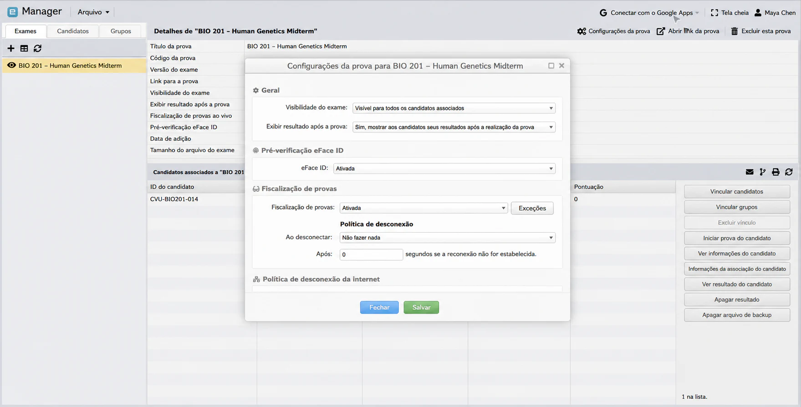
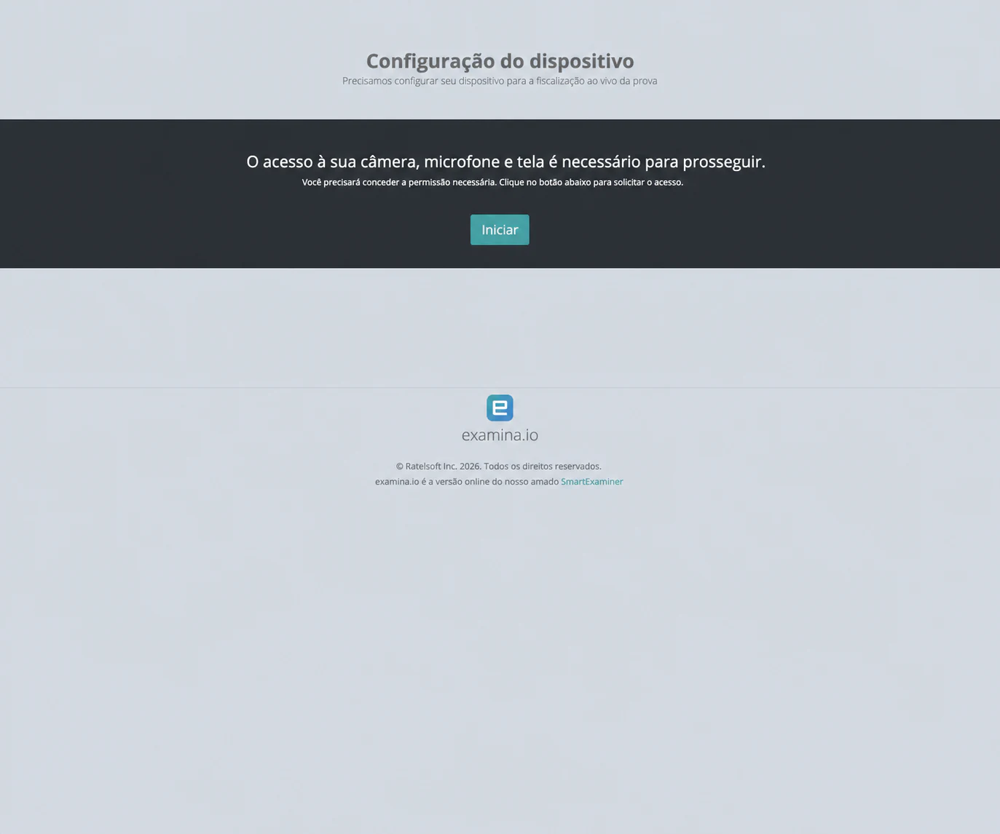
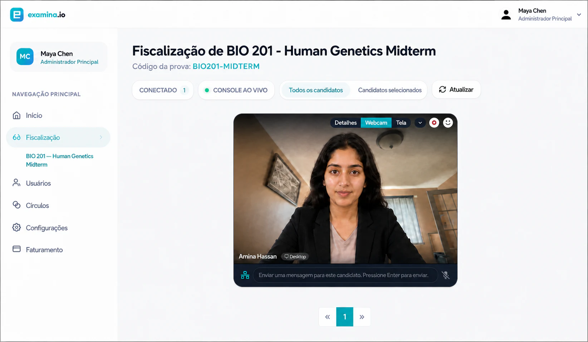
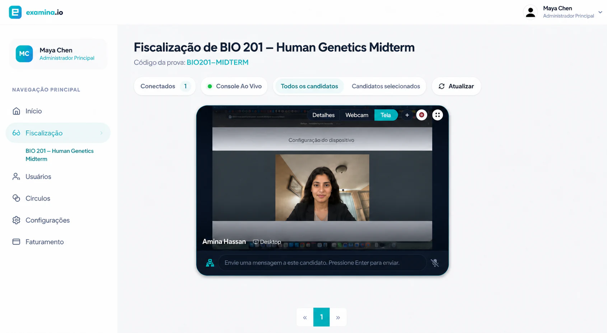
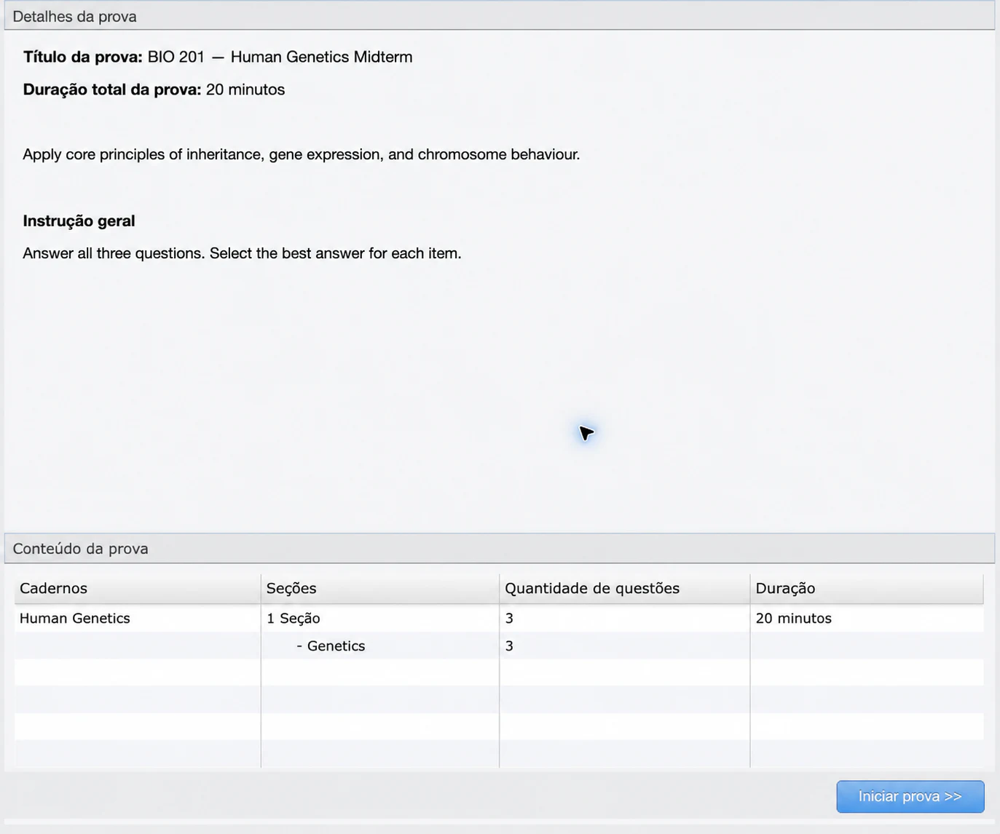
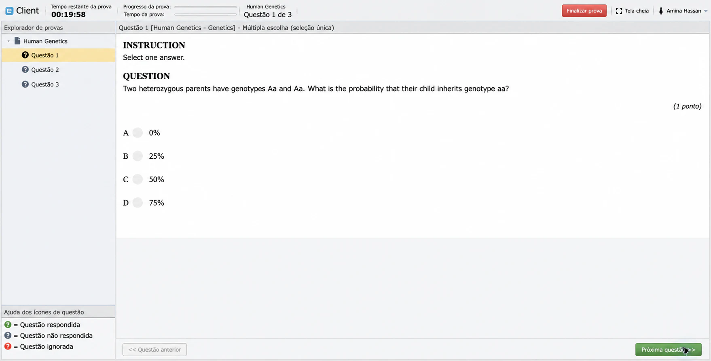
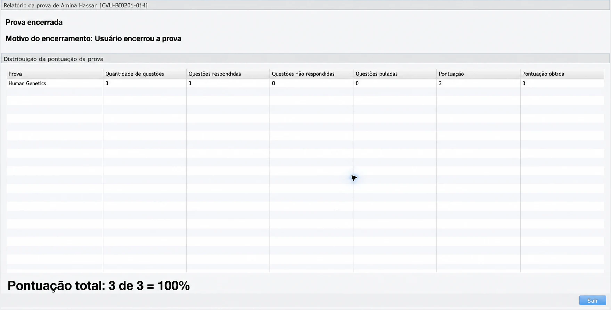

# Fiscalizar uma prova ao vivo

A fiscalização ao vivo permite que um fiscal autorizado veja a webcam e a
tela compartilhada, envie mensagens, autorize o início e acompanhe a sessão no
console da Examina.

O exemplo usa **Cedar Valley University**, **Amina Hassan** e **BIO 201 — Human
Genetics Midterm**.

## Antes da prova

Confirme vínculos, cadernos, duração, janela de início, instruções e exibição
de resultados. Ative **Fiscalização ao vivo** e, quando necessário,
**Verificação eFaceID**. Dê ao fiscal a função e o acesso ao Círculo corretos.

O candidato precisa de computador, câmera, microfone, navegador atual,
compartilhamento de tela e rede estável. O fiscal usa outro computador e outra
sessão. Em produção, use HTTPS: um endereço HTTP comum da rede local não pode
solicitar permissões de mídia.

### Configurar a avaliação

Revise vínculos, horários, instruções e permissões antes de publicar.

### Preparar dispositivos e redes

Faça um ensaio completo com um candidato fictício antes da prova.

## 1. Configuração do dispositivo

Depois de entrar e, se aplicável, concluir o
[eFaceID](efaceid-identity-verification.md), o candidato vê **Configuração do
dispositivo**.

Ele seleciona **Iniciar**, permite câmera e microfone e compartilha a aba da
prova ou a tela prevista. Antes, deve fechar janelas e notificações privadas.

!!! warning "Não compartilhe conteúdo privado"

    Feche janelas e notificações sem relação com a prova. Quando a política
    permitir, compartilhe somente a aba da prova.

## 2. Abrir o console

O fiscal abre a prova em **Fiscalização**. No menu do candidato, escolhe
**Solicitar áudio e vídeo do candidato**, permite o microfone do navegador e
aguarda a conexão. Após uma reconexão, atualize o console antes de pedir os
fluxos novamente.

## 3. Verificar webcam e tela

Em **Webcam**, confirme identidade, iluminação, ângulo e ausência de outra
pessoa.

Em **Tela**, confirme que a prova ou a tela combinada está sendo compartilhada.

As imagens usam uma candidata fictícia para preservar a privacidade e mantêm o
estado real do console testado.

## 4. Autorizar o início

Após as verificações, abra o menu do candidato correto e escolha **Autorizar
início**. Confira a mensagem de sucesso. O candidato recebe **Configuração
concluída** e revisa título, duração, instruções, cadernos e número de questões.

## 5. Acompanhar e concluir

A fiscalização continua enquanto o candidato responde no Client.

Acompanhe a conexão, intervenha apenas quando necessário, registre incidentes
conforme a política e diferencie falha técnica de conduta irregular. Não
colete conteúdo pessoal sem relação com a prova.

Ao terminar, o candidato escolhe **Finalizar prova** e confirma o envio. No
Manager, confira respondidas, não respondidas, ignoradas, nota obtida e nota
possível.

## 6. Encerrar a sessão

O candidato confirma o envio; o fiscal aguarda o encerramento normal dos
fluxos antes de fechar o console.

## 7. Verificar o resultado

No Manager, confira o estado final, as respostas, a nota e a resolução de
qualquer incidente registrado.

## Incidentes comuns

**Tela em branco**: pare e compartilhe novamente a aba ou tela da prova,
atualize o console e solicite os fluxos outra vez.

**Aguardando transmissão**: confirme HTTPS ou localhost, permissões,
**Iniciar** no lado do candidato e a solicitação do fiscal.

**Nova permissão do sistema**: reinicie o navegador se o sistema operacional
solicitar.

**Mudança de navegador**: encerre a sessão anterior ou espere a presença
expirar; o eFaceID pode precisar ser repetido.

**Queda de conexão**: preserve a tentativa, restaure a rede e siga a política
de desconexão. Não apague um resultado como recuperação rotineira.

## Lista para o dia da prova

- Fiscal conectado em outro computador.
- Prova correta aberta em **Fiscalização**.
- Identidade e foto verificadas quando o eFaceID é usado.
- Câmera, microfone e tela permitidos.
- Webcam e tela verificadas antes da autorização.
- Candidato correto autorizado explicitamente.
- Resultado final validado no Manager.
