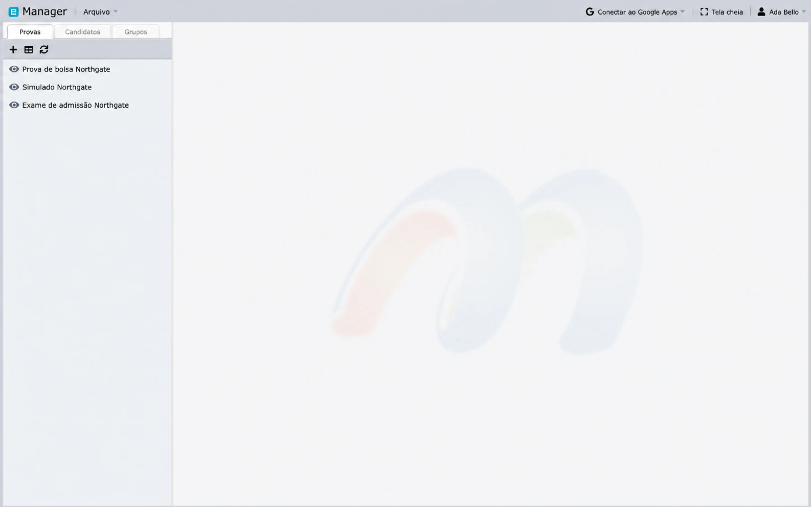
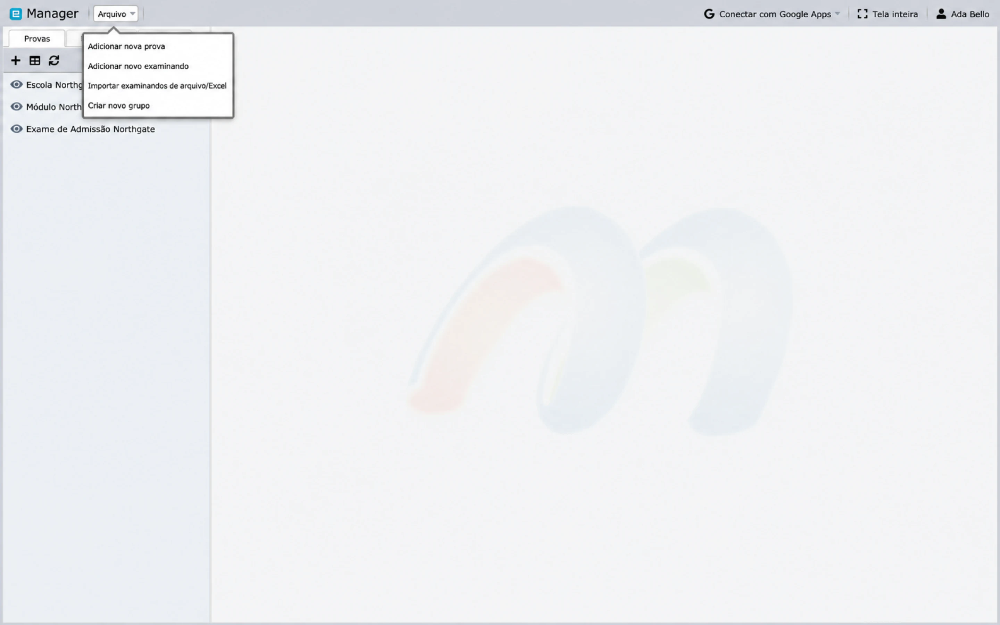
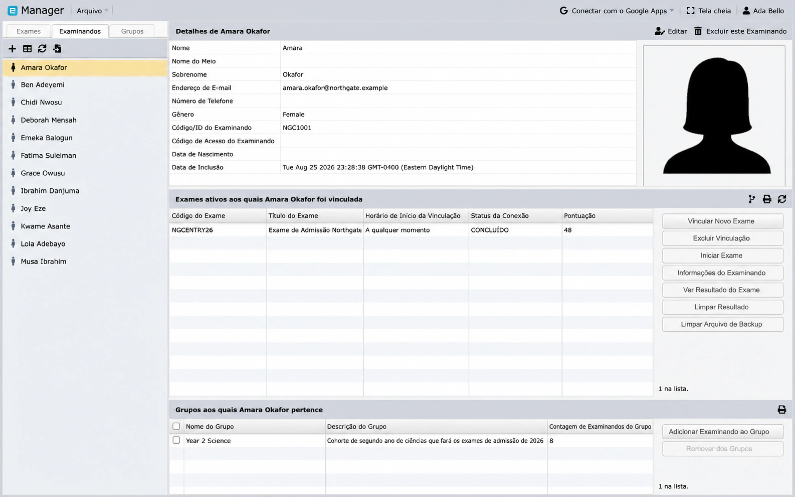
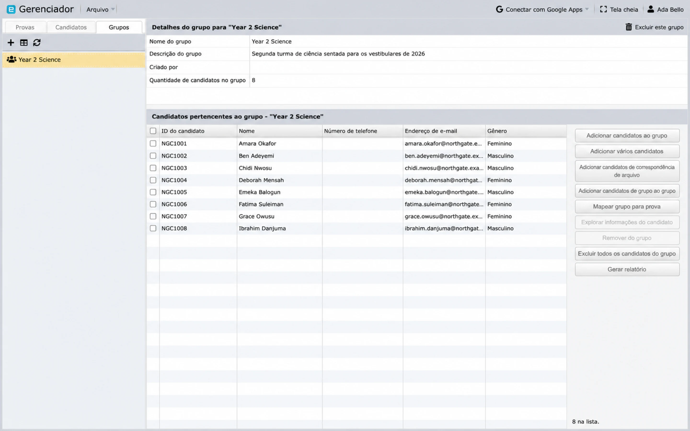

# Visão geral do Manager

O Manager é o espaço de trabalho para administração de provas. Ele conecta uma prova exportada aos registros de candidatos, atribuições de provas, configurações de aplicação, monitoramento e resultados.

## Abrir o Manager

Faça login, abra **Início** e selecione **Manager** na Galeria de Aplicativos. Usuários comuns, Administradores e Root podem abrir o Manager, mas as provas e candidatos aos quais têm acesso podem ser limitados por [Circles](../administration/circles-and-permissions.md).

## Espaço de trabalho principal

O Manager possui três abas de recursos:

- **Exams** lista as avaliações importadas.
- **Examinees** lista os candidatos que podem ser mapeados para as provas.
- **Groups** lista coleções reutilizáveis de candidatos.

Selecione um item no painel esquerdo para abrir seus detalhes e ações disponíveis. A pequena barra de ferramentas acima de cada lista adiciona um novo registro, alterna para uma visualização de tabela e atualiza os dados do servidor. Atualize sempre que outro usuário possa ter alterado os dados.

O menu **Arquivo** contém os quatro comandos de criação, e eles são os mesmos independentemente da aba em que você estiver:

- **Adicionar Nova Prova**
- **Adicionar Novo Candidato**
- **Importar Candidatos de Arquivo/Excel**
- **Criar Novo Grupo**

## Sequência operacional recomendada

1. [Importe a prova](import-exams.md).
2. [Adicione ou importe candidatos](examinees.md).
3. Opcionalmente, crie Grupos.
4. [Atribua candidatos ou Grupos](groups-and-assignments.md) à prova e às suas seções.
5. Revise as configurações de visibilidade, exibição de resultados, fiscalização de provas, identidade, dispositivo e desconexão.
6. Teste o link da prova com um candidato de teste designado.
7. Publique e comunique a prova.
8. [Monitore a sessão e gere os resultados](deliver-monitor-report.md).

## Provas

O registro de uma prova mostra seu título, código e versão, o link que os candidatos usam, visibilidade, se os resultados são exibidos após a prova, se a fiscalização de provas ao vivo e a pré-verificação pelo eFace ID estão ativas, o horário em que foi adicionada, o tamanho do arquivo importado e o fluxo de cadernos de prova. As ações da prova podem incluir:

- mapear candidatos ou Grupos;
- abrir o link da prova;
- enviar e-mail para candidatos mapeados;
- alternar visibilidade ou exibição de resultados;
- configurar fiscalização de provas ao vivo e verificação de identidade;
- iniciar, parar ou monitorar uma prova elegível; e
- gerenciar permissões e configurações de aplicação; e
- visualizar resultados ou gerar relatórios.

As ações disponíveis dependem do tipo de prova, da função da conta, do plano e do estado atual da prova.

## Candidatos

O registro de um candidato armazena um código ou ID exclusivo, senha, nome, gênero e detalhes opcionais, como e-mail, número de telefone, data de nascimento e fotografia. Abaixo dos detalhes há dois painéis: as provas às quais essa pessoa está mapeada e os Grupos aos quais ela pertence. A partir daqui, você pode gerenciar a associação a Grupos, mapear uma prova e cadernos, revisar detalhes do mapeamento e visualizar um resultado concluído.

## Grupos

Um Grupo é uma coleção operacional de candidatos, como uma turma, coorte ou sessão de prova. Mapear um Grupo para uma prova aplica a atribuição aos membros atuais do Grupo que ainda não estejam mapeados.

Grupos são diferentes de Circles: os Grupos facilitam o trabalho em lote com candidatos; os Circles controlam o acesso da equipe.

## Práticas recomendadas para uma preparação segura

- Mantenha a prova invisível até que o conteúdo, as atribuições e as configurações sejam verificados.
- Use códigos de candidato exclusivos e um canal seguro para as senhas.
- Verifique o fuso horário sempre que uma atribuição incluir um horário de início.
- Teste com dados fictícios ou de teste aprovados.
- Atualize a tela antes de tomar qualquer ação em relação ao status de conexão ou resultados.
- Trate ações como **Limpar resultado**, exclusão e regeração de chaves como sensíveis.

## Próximos passos

Se você já possui uma exportação do Designer, continue com [Importar provas](import-exams.md). Se a prova já estiver presente, vá para [Adicionar e importar candidatos](examinees.md).
